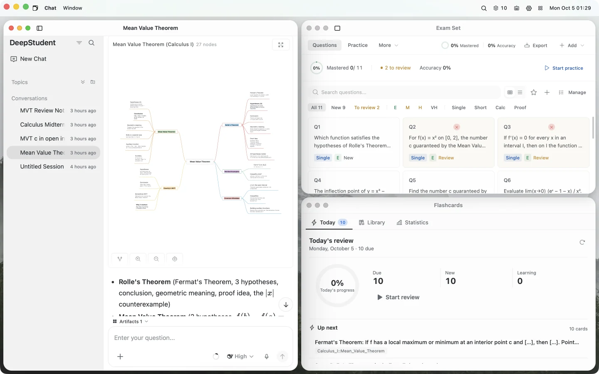
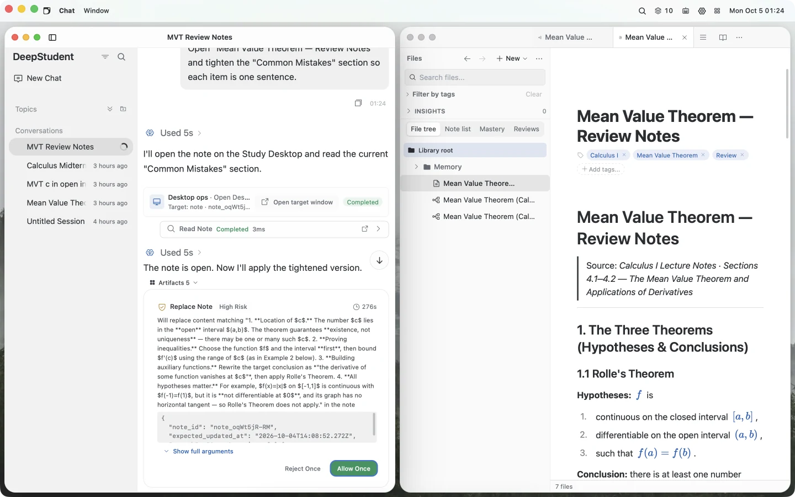
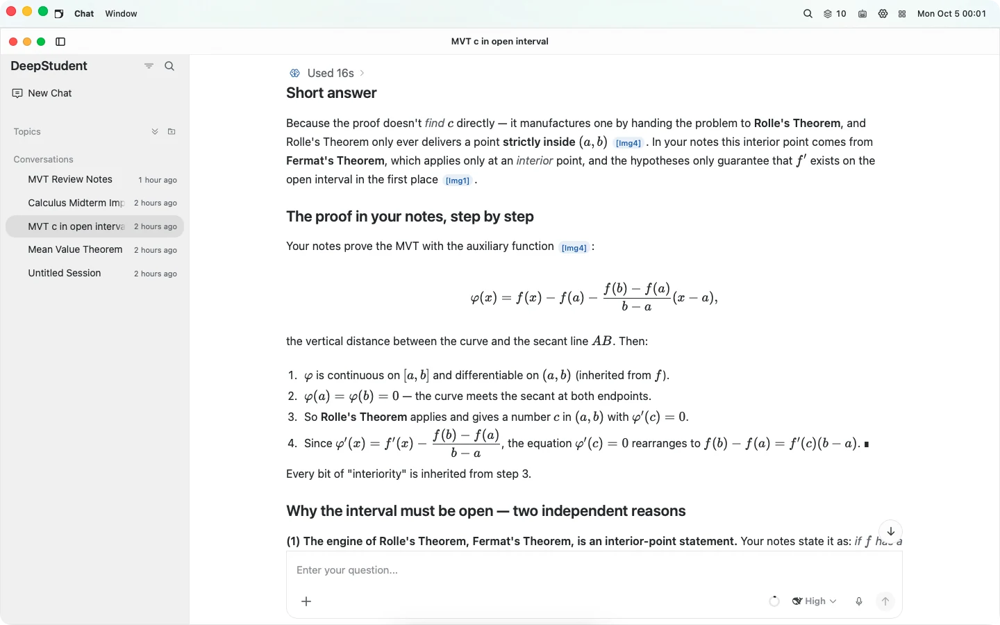
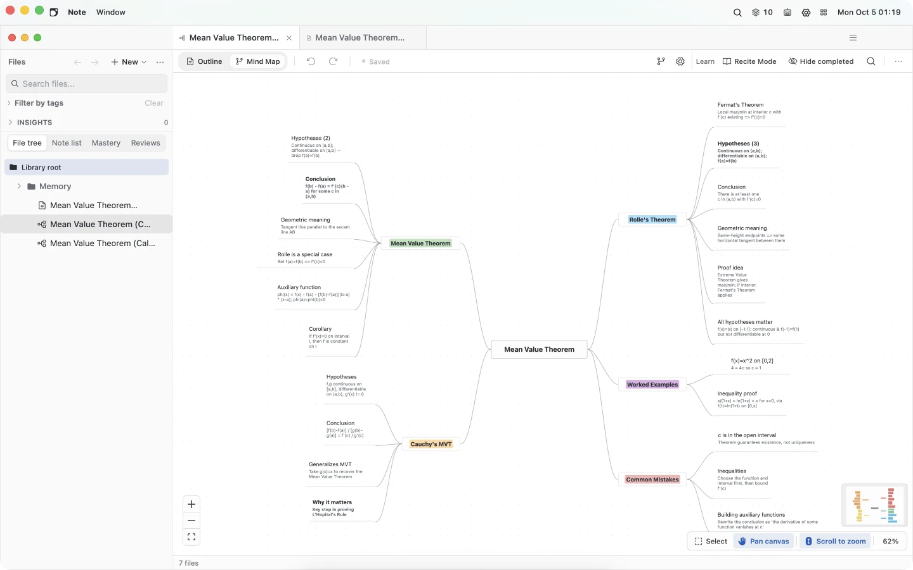
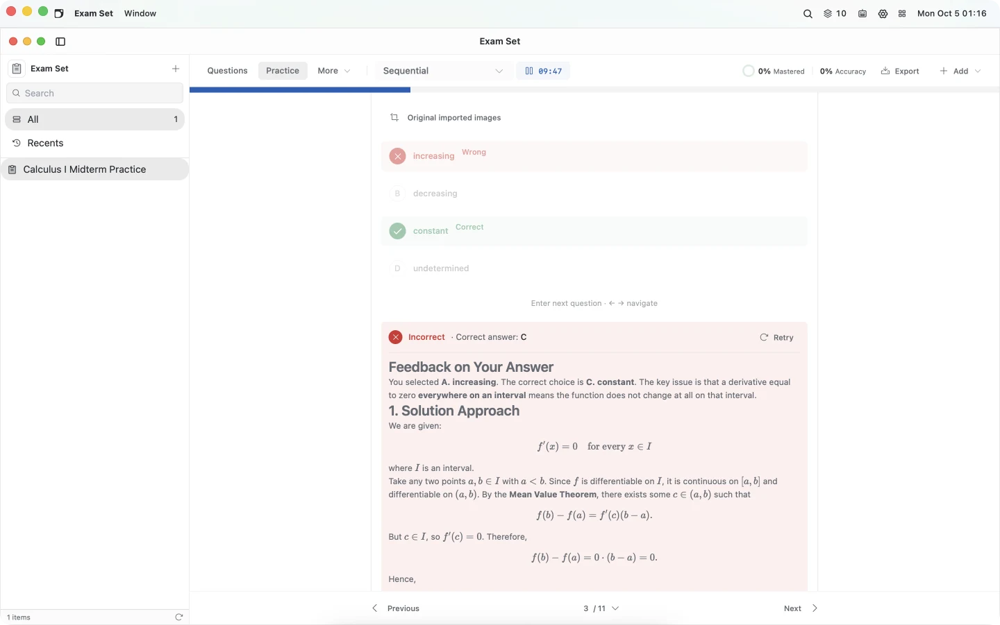
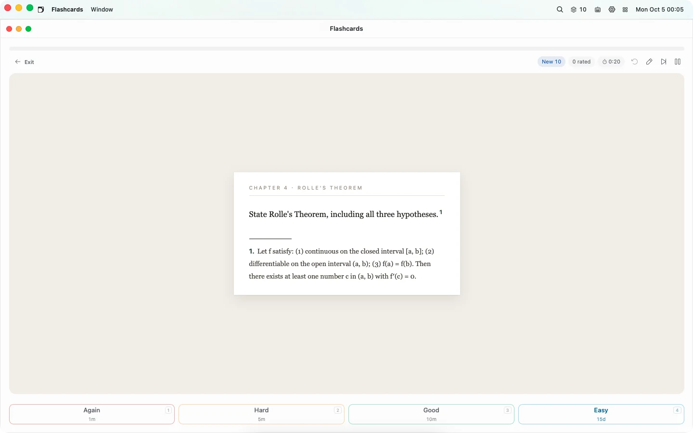
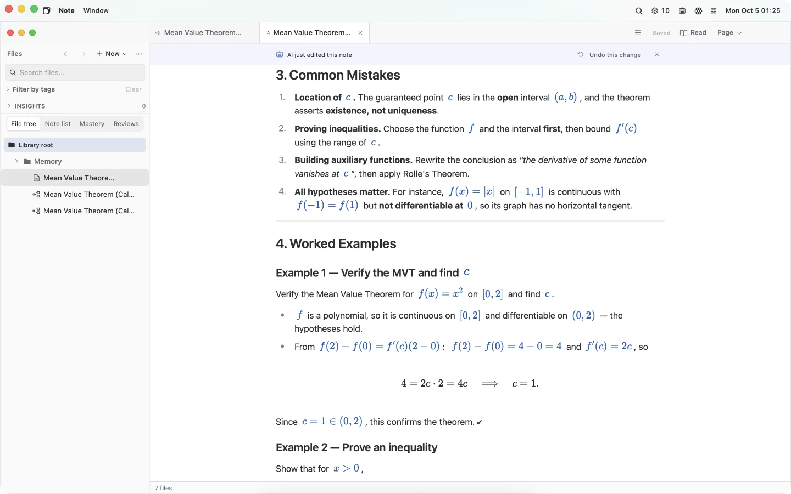
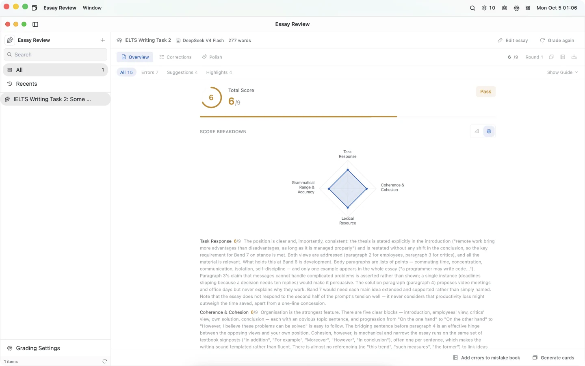
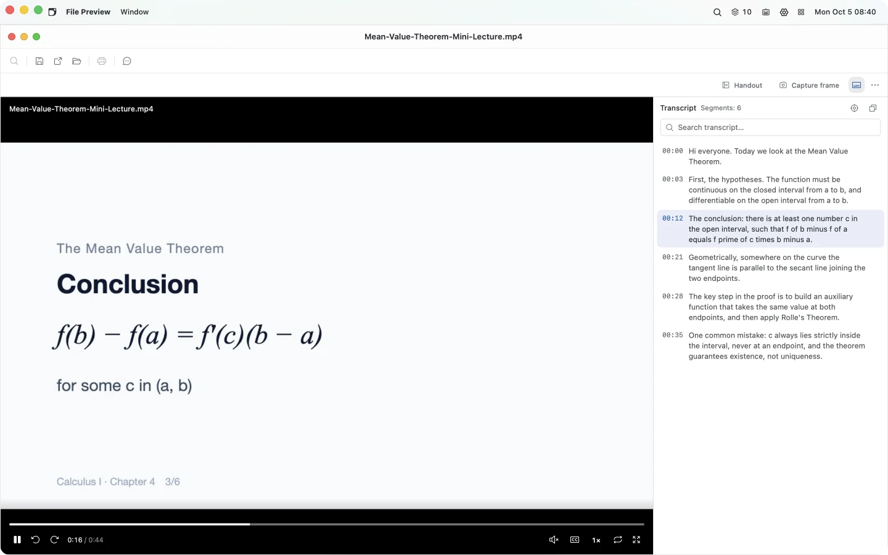

<div align="center">

[简体中文](./README_CN.md) | **English**


# DeepStudent

### Just focus on learning. Leave the rest to me.

An open-source, local-first AI learning workbench.<br />
Its study agent works directly in every app on your Study Desktop.

[](https://github.com/helixnow/deep-student/releases/latest)
[](LICENSE)
[](https://github.com/helixnow/deep-student)

[Website](https://deepstudent.cn/en/) ·
[**Download**](#installation) ·
[Docs (Chinese)](https://deepstudent.cn/start) ·
[Report an issue](https://github.com/helixnow/deep-student/issues) ·
[Contributing](./.github/CONTRIBUTING.md)

</div>

<p align="center">
  
</p>

---

## A study agent that works in every app

One sentence is enough. The agent opens the right app and produces the notes, mind maps, questions, cards and review plan; longer tasks it carries through on its own.

**It does the work.**
Notes, mind maps, exam sets, flashcards, todos, essay review and translation all have agent tools, so results land directly in the app instead of staying in a chat window. It can also operate the Study Desktop itself, research the web and academic papers, turn a recorded lecture into timestamped notes, and produce Word, PowerPoint and Excel files.

**Long tasks, handed off.**
Research, organizing and question writing keep moving without you: goal mode continues across turns, sub-agents work in parallel, and scheduled automations run on time.

**Every step under control.**
Actions are approved by risk level, with Ask / Plan / Craft permission modes. Edits to notes and the Study Desktop can be undone, and answers cite the page, sentence or mind-map node they came from.

**Knows you, grows with you.**
It remembers your weak spots and study habits. 56 built-in skills load on demand, MCP connects external tools, and 13 model providers are preset — with a different model per feature if you like.

<p align="center">
  
</p>

---

## The apps it works in

Every app sits in the Study Desktop's Dock. Open one on its own, place several side by side, or let the agent open them for you.

| App | What it does |
|---|---|
| **Chat** | Study around your own materials; answers cite the original page. Groups, search and export. |
| **Files** | Textbooks, notes, question sets, documents, audio and video in one library, indexed for AI search on import (OCR included). |
| **Media** | Transcribe lectures and recordings with timestamps, follow along with a synced transcript, and get answers that cite and jump to the exact moment; turn a lesson into an illustrated handout in Notes. |
| **Textbook** | PDF, Word and EPUB reading with highlights and notes; select text and ask about it. |
| **Notes** | Markdown notes with backlinks, tags and math; agent edits are highlighted and can be undone. |
| **Mind Map** | A full mind map from one sentence; outline and canvas views, plus a recite mode that hides key nodes. |
| **Exam Set** | Drop in an exam or textbook and get a question set; nine practice modes, auto grading, handwritten answers. |
| **Flashcards** | Review, card making and templates in one place: built-in FSRS spaced repetition and memory curves, cards from PDFs, images, notes or videos in one request, APKG import/export and Anki sync — no Anki install required. |
| **Essay Review** | Scores against exam rubrics (Gaokao, IELTS, postgraduate exams and more), inline marks, sentence polishing. |
| **Translation** | Full-text translation with paragraph-by-paragraph comparison and 7 domain presets. |
| **Todo · Pomodoro** | Today's reviews and tasks in one list; a focus timer with stats. |
| **Skills** | Built-in and community skills, plus MCP servers; install them or write your own. |

<table>
  <tr>
    <td width="50%"></td>
    <td width="50%"></td>
  </tr>
  <tr>
    <td></td>
    <td></td>
  </tr>
  <tr>
    <td></td>
    <td></td>
  </tr>
</table>

<p align="center">
  
</p>

Full guides for every app: [deepstudent.cn/user-guide](https://deepstudent.cn/user-guide/) (Chinese).

---

## Your data stays on your machine

- **Local storage.** Materials, notes, chats and indexes are stored locally (SQLite, LanceDB and local files). Back up or migrate via *Settings → Data governance*.
- **When data leaves your machine.** Model calls, web search and MCP send the relevant requests to the services you configured; cloud sync and Sentry error reporting send data only when you turn them on.
- **Cloud sync (experimental).** Desktop supports WebDAV, S3-compatible storage and experimental FTP; Android is WebDAV only. Each backup uploads the whole package as a single ZIP (no incremental transfer, dedup or CDC). The default cloud ZIP is a portable archive and cannot slot-restore; with a cloud E2EE password configured, *Backup to Cloud Now* exports an encrypted full-fidelity ZIP, and if that password cannot be read, export is refused rather than falling back to a portable archive. It is not real-time collaboration.
- **Open source, verifiable.** AGPL-3.0. Everything privacy-related is in this repository.

---

## Installation

Download the latest release from [GitHub Releases](https://github.com/helixnow/deep-student/releases/latest) or [deepstudent.cn](https://deepstudent.cn/download):

| Platform | Package | Architecture |
|:---:|---|---|
| macOS | `.dmg` | Apple Silicon / Intel |
| Windows | `.exe` | x86_64 |
| Linux | `.deb` / `.rpm` / `.AppImage` | x86_64 |
| Android | `.apk` | arm64 |

> **iOS:** source build only via Xcode. See [Build Configuration](./docs/BUILD-CONFIG.md).
>
> **macOS says the app "is damaged":** run `sudo xattr -r -d com.apple.quarantine "/Applications/Deep Student.app"`.

After installing, add an API key for one of the preset model providers (or a local model) in *Settings*, open Chat and ask for something — for example: *"Read chapter 3 of my textbook, then make a mind map and 10 flashcards."*

---

## For developers

### Architecture

```
DeepStudent
├── Interface      Study Desktop (macOS · Windows · Linux) and mobile (Android; iOS source build)
├── Agent          Chat V2 runtime · skills with progressive disclosure · approvals & undo · sub-agents · MCP
├── Apps           chat · files · media · notes · mind map · exam set · flashcards · essay · translation · todo · pomodoro
├── Data layer     VFS · SQLite metadata · LanceDB vector index · local blob storage
└── Integrations   13 model providers · 8 web search engines · 6 OCR engines · arXiv / Scholar
```

<details>
<summary>Code structure</summary>

```
DeepStudent
├── src/                      # React frontend
│   ├── features/             #   26 feature modules (chat, workbench, flashcards, notes, mindmap, practice,
│   │                         #   learning-hub, media-studio, learning-today, insights, todo, pomodoro, browser, …)
│   │   └── chat/             #     Chat V2: core store / skills (builtin, builtin-tools) / components / plugins
│   ├── components/           #   Shared UI
│   ├── stores/               #   Zustand stores
│   ├── dstu/                 #   DSTU resource protocol & VFS API
│   ├── essay-grading/        #   Essay review frontend
│   ├── translation/          #   Translation frontend
│   └── locales/              #   i18n (zh-CN / en-US)
├── src-tauri/src/            # Tauri / Rust backend
│   ├── chat_v2/              #   Agent pipeline & tool executors
│   ├── llm_manager/          #   Model providers & adapters
│   ├── vfs/                  #   Virtual file system & vector indexing
│   ├── memory/               #   Memory & learner profile
│   ├── mcp/                  #   MCP client
│   ├── tools/                #   Web search adapters
│   ├── ocr_adapters/         #   OCR adapters
│   ├── cloud_storage/        #   Cloud sync (S3 / WebDAV)
│   └── data_governance/      #   Backup, audit, migration
├── docs/                     # User guide & design docs
└── .github/workflows/        # CI & release automation
```

</details>

### Tech stack

| Area | Technology |
|---|---|
| Frontend | React 18 · TypeScript 5.6 · Vite 6 |
| UI | Tailwind CSS 3 · Radix UI · Phosphor Icons |
| Desktop / mobile | Tauri 2 (Rust) |
| Data | SQLite (rusqlite) · LanceDB · local blob storage |
| State | Zustand 5 · Immer |
| Editors | Milkdown 7 · CodeMirror |
| Documents | PDF.js · pdfium-render · multi-engine OCR |
| CI / CD | GitHub Actions · Release Please |

### Local development

Requires Node.js 20+, stable Rust ([rustup](https://rustup.rs)) and npm (don't mix with pnpm / yarn).

```bash
git clone https://github.com/helixnow/deep-student.git
cd deep-student
npm ci
npm run tauri dev
```

Packaging and cross-platform builds: [BUILD-CONFIG.md](./docs/BUILD-CONFIG.md).

### Documentation

| Document | Description |
|---|---|
| [User guide](https://deepstudent.cn/user-guide/) | Every app and workflow (Chinese; source in [`docs/user-guide`](./docs/user-guide/)) |
| [Project history](https://deepstudent.cn/timeline) | How DeepStudent evolved, from early experiments to v0.10 (Chinese) |
| [Build configuration](./docs/BUILD-CONFIG.md) | Cross-platform build & packaging |
| [Changelog](./CHANGELOG.md) | Version history |
| [Security policy](./.github/SECURITY.md) | Reporting vulnerabilities |

---

## Contributing

1. Read [CONTRIBUTING.md](./.github/CONTRIBUTING.md) for the workflow.
2. Make sure `npm run lint` and type checks pass before opening a PR.
3. Report bugs and ideas in [Issues](https://github.com/helixnow/deep-student/issues).

## License

[AGPL-3.0](./LICENSE)

## Acknowledgments

DeepStudent is built on these open-source projects:

**Frameworks & runtimes** —
[Tauri](https://tauri.app) · [React](https://react.dev) · [Vite](https://vite.dev) · [TypeScript](https://www.typescriptlang.org) · [Rust](https://www.rust-lang.org) · [Tokio](https://tokio.rs)

**Editors & rendering** —
[Milkdown](https://milkdown.dev) · [ProseMirror](https://prosemirror.net) · [CodeMirror](https://codemirror.net) · [KaTeX](https://katex.org) · [Mermaid](https://mermaid.js.org) · [react-markdown](https://github.com/remarkjs/react-markdown)

**UI** —
[Tailwind CSS](https://tailwindcss.com) · [Radix UI](https://www.radix-ui.com) · [Phosphor Icons](https://phosphoricons.com) · [Framer Motion](https://www.framer.com/motion) · [Recharts](https://recharts.org) · [React Flow](https://reactflow.dev)

**Data & state** —
[LanceDB](https://lancedb.com) · [SQLite](https://www.sqlite.org) / [rusqlite](https://github.com/rusqlite/rusqlite) · [Apache Arrow](https://arrow.apache.org) · [Zustand](https://zustand.docs.pmnd.rs) · [Immer](https://immerjs.github.io/immer) · [Serde](https://serde.rs)

**Documents** —
[PDF.js](https://mozilla.github.io/pdf.js/) · [pdfium-render](https://github.com/ajrcarey/pdfium-render) · [docx-preview](https://github.com/VolodymyrBaydalka/docxjs) · [docx-rs](https://github.com/bokuweb/docx-rs) · [umya-spreadsheet](https://github.com/MathNya/umya-spreadsheet) · [Mustache](https://mustache.github.io) · [DOMPurify](https://github.com/cure53/DOMPurify)

**i18n & tooling** —
[i18next](https://www.i18next.com) · [date-fns](https://date-fns.org) · [Vitest](https://vitest.dev) · [Playwright](https://playwright.dev) · [ESLint](https://eslint.org) · [Sentry](https://sentry.io)
