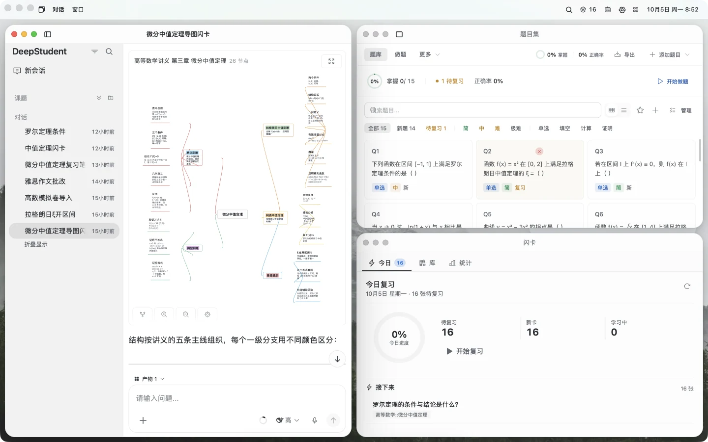
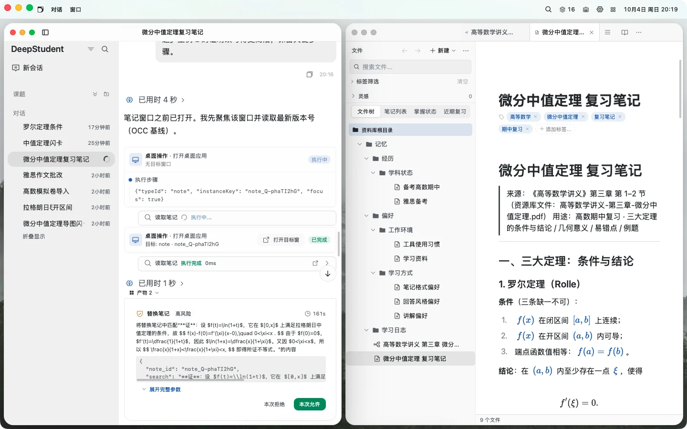
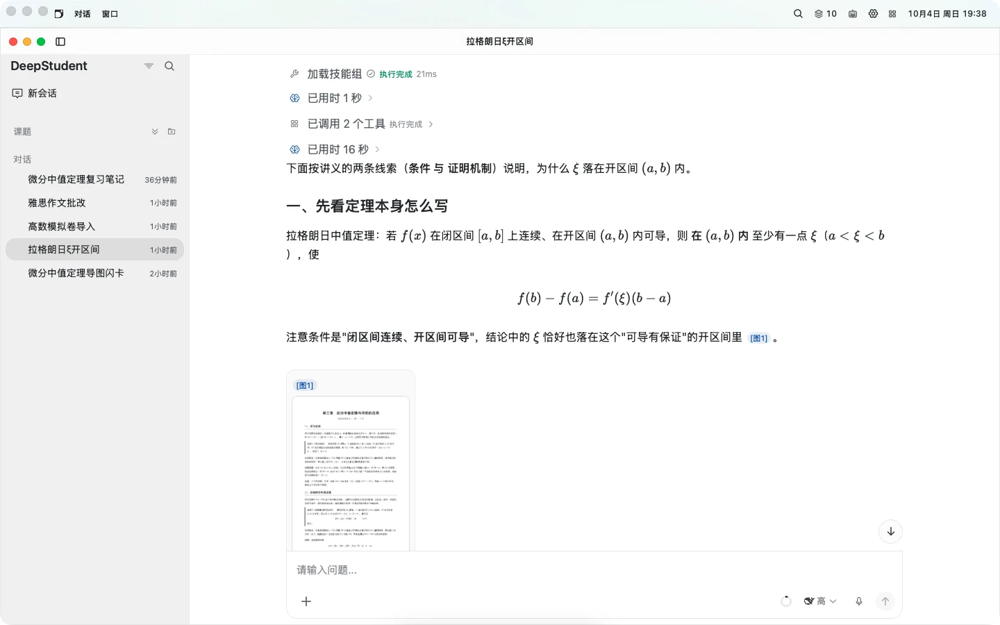
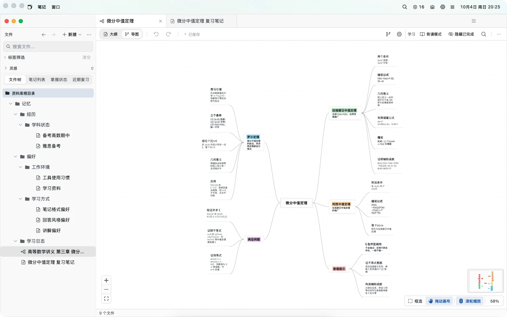
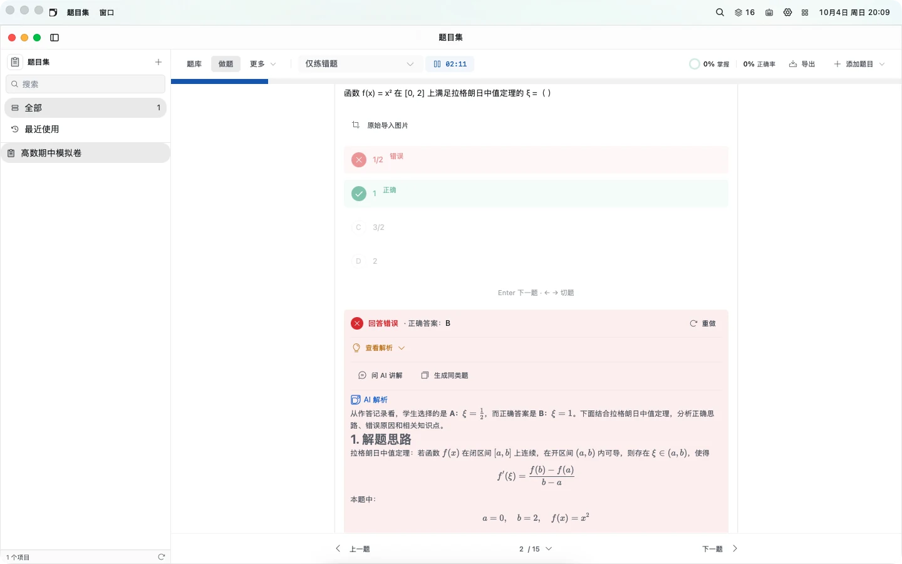
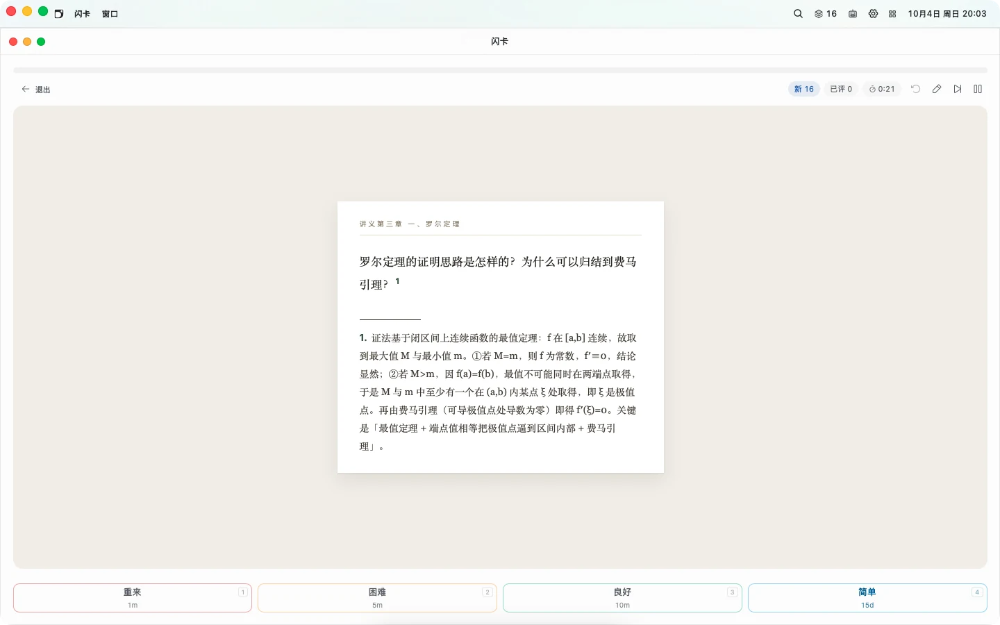
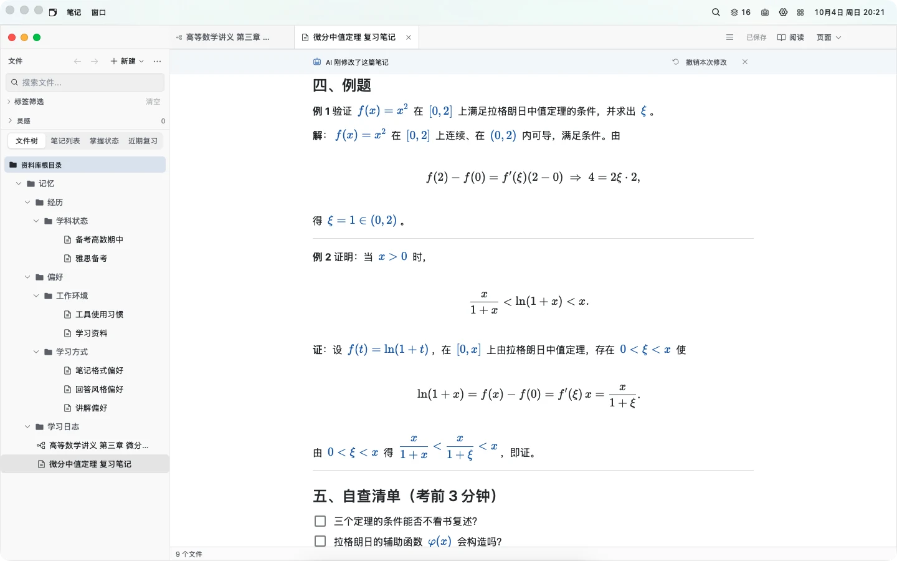
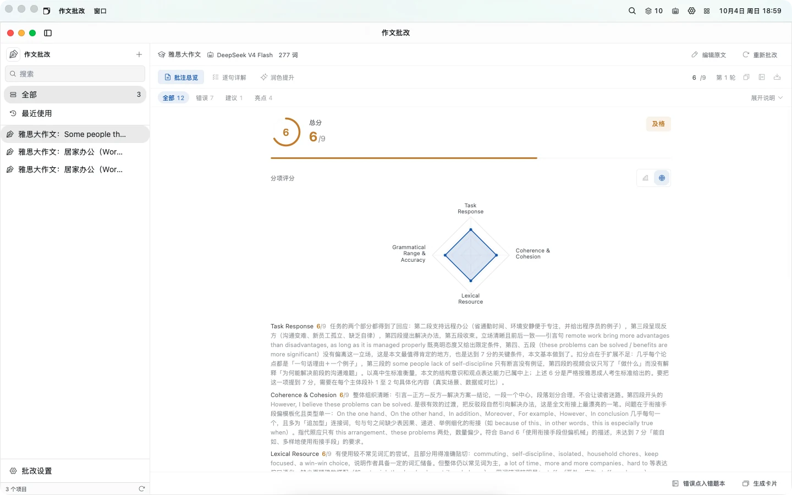
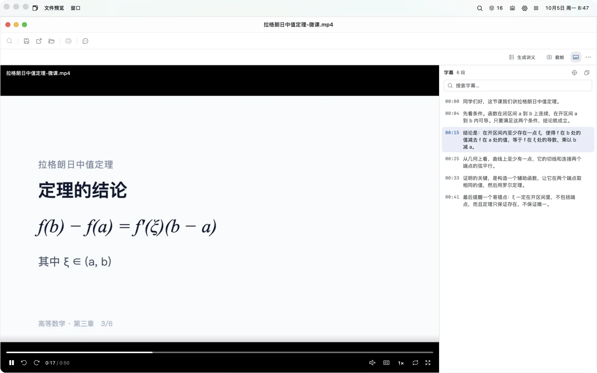

<div align="center">

**简体中文** | [English](./README.md)


# DeepStudent

### 只专注学习本身就够了，剩下的都交给我。

开源、本地优先的 AI 学习工作台。<br />
它的学习 Agent，可直接操作学习桌面上的每一个应用。

[](https://github.com/helixnow/deep-student/releases/latest)
[](LICENSE)
[](https://github.com/helixnow/deep-student)

[官网](https://deepstudent.cn) ·
[**下载**](#安装) ·
[快速上手](https://deepstudent.cn/start) ·
[使用指南](https://deepstudent.cn/user-guide/) ·
[问题反馈](https://github.com/helixnow/deep-student/issues) ·
[参与贡献](./.github/CONTRIBUTING.md)

</div>

<p align="center">
  
</p>

---

## 一个学习 Agent，直接操作每一个应用

只需一句话，它即可打开对应的应用，完成笔记、思维导图、题目、卡片与复习计划；更长的任务可交由它独立推进。

**直接动手。**
笔记、思维导图、题目集、闪卡、待办、作文批改与翻译都有对应的 Agent 工具，结果直接写进应用，不停留在对话框里。它还可操作学习桌面本身，检索网页与学术论文，把一节网课整理成带时间戳的讲义，并生成 Word、PPT 与 Excel 文件。

**长任务可托付。**
调研、整理、出题可交给它连续推进：目标模式跨轮续跑，子代理并行处理，定时自动化按时执行。

**每一步可控。**
操作按风险分级审批，Ask / Plan / Craft 三种权限模式可选；笔记与学习桌面上的改动可撤销，回答中的引用可定位到原文页码、句子或导图节点。

**懂你，可扩展。**
记住你的薄弱点与学习习惯。内置 56 个技能按需加载，支持 MCP 接入外部工具，预置 13 家模型服务商，可按功能分别指定模型。

<p align="center">
  
</p>

---

## Agent 能操作的应用

所有应用都在学习桌面的 Dock 里：可以单独打开，可以并排摆放，也可以交给 Agent 打开。

| 应用 | 用途 |
|---|---|
| **对话** | 围绕自己的资料学习，回答标注原文页码；支持分组、搜索与导出。 |
| **资源库** | 教材、笔记、题目、文档与音视频统一入库，导入即建立 AI 检索索引（含 OCR）。 |
| **音视频** | 网课、讲座录音一键转写为带时间戳的字幕，边看边对照；AI 回答引用到具体时刻，可一键跳回原处，也可整理成图文讲义存为笔记。 |
| **教材** | PDF、Word、EPUB 阅读，高亮批注，划选文字即可提问。 |
| **笔记** | 支持双链、标签与公式的 Markdown 笔记；Agent 的修改会高亮标注，可一键撤销。 |
| **思维导图** | 一句话生成完整导图，大纲与画布两种视图，背诵模式遮住要点自测。 |
| **题目集** | 拖入试卷或教材即可生成题目集；九种练习模式、自动判分，支持手写作答。 |
| **闪卡** | 复习、制卡、模板集中在一处：内置 FSRS 间隔重复与记忆曲线，一句话从 PDF、图片、笔记或视频生成卡片，APKG 双向导入导出并可同步 Anki，无需安装 Anki。 |
| **作文批改** | 按高考、雅思、考研等评分标准逐项打分，原文标注，逐句润色。 |
| **翻译** | 整篇翻译、逐段对照，7 种领域预设。 |
| **待办 · 番茄钟** | 今日的复习与待办汇总在同一张清单；专注计时与统计。 |
| **技能** | 内置技能、社区技能与 MCP 服务；可安装，也可自己编写。 |

<table>
  <tr>
    <td width="50%"></td>
    <td width="50%"></td>
  </tr>
  <tr>
    <td></td>
    <td></td>
  </tr>
  <tr>
    <td></td>
    <td></td>
  </tr>
</table>

<p align="center">
  
</p>

每个应用的完整说明见 [使用指南](https://deepstudent.cn/user-guide/)。

---

## 数据默认存在本机

- **本机存储。** 资料、笔记、聊天记录与检索索引默认保存在本机（SQLite、LanceDB 与本地文件），可通过「设置 → 数据治理」备份和迁移。
- **数据离开本机的情形。** 调用模型、外部搜索或 MCP 时，相关请求会发给你配置的服务；云同步与 Sentry 错误报告仅在主动开启后发送相应数据。
- **云同步（实验性）。** 桌面端支持 WebDAV、S3 兼容存储与实验性 FTP，Android 仅 WebDAV。每次备份把整包作为一个完整 ZIP 上传，没有增量传输、去重或 CDC。默认「立即备份到云端」生成便携归档，不能整槽恢复；配置云端端到端加密密码后导出加密的全保真 ZIP，读不到已存密码时拒绝导出，不会退回便携归档。云同步不是实时协作。
- **开源可核对。** AGPL-3.0 许可，与隐私相关的实现都在本仓库中。

---

## 安装

从 [GitHub Releases](https://github.com/helixnow/deep-student/releases/latest) 或 [官网下载页](https://deepstudent.cn/download) 获取最新版本：

| 平台 | 安装包 | 架构 |
|:---:|---|---|
| macOS | `.dmg` | Apple Silicon / Intel |
| Windows | `.exe` | x86_64 |
| Linux | `.deb` / `.rpm` / `.AppImage` | x86_64 |
| Android | `.apk` | arm64 |

> **iOS：** 仅支持通过 Xcode 从源码构建，详见 [构建配置](./docs/BUILD-CONFIG.md)。
>
> **macOS 提示「已损坏，无法打开」：** 在终端执行 `sudo xattr -r -d com.apple.quarantine "/Applications/Deep Student.app"`。

安装后，在「设置」中为任一预置模型服务商填入 API 密钥（或接入本地模型），然后打开对话直接提出需求，例如：「读一下教材第三章，画一张思维导图，再出 10 张卡片。」

---

## 开发者

### 架构

```
DeepStudent
├── 界面层    学习桌面（macOS · Windows · Linux）与移动端（Android；iOS 源码构建）
├── Agent 层  Chat V2 运行时 · 渐进披露的技能 · 审批与撤销 · 子代理 · MCP
├── 应用层    对话 · 资源库 · 音视频 · 笔记 · 思维导图 · 题目集 · 闪卡 · 作文 · 翻译 · 待办 · 番茄钟
├── 数据层    VFS · SQLite 元数据 · LanceDB 向量索引 · 本地 Blob 存储
└── 集成      13 家模型服务商 · 8 个搜索引擎 · 6 个 OCR 引擎 · arXiv / Scholar
```

<details>
<summary>代码结构</summary>

```
DeepStudent
├── src/                      # React 前端
│   ├── features/             #   26 个功能模块（chat、workbench、flashcards、notes、mindmap、practice、
│   │                         #   learning-hub、media-studio、learning-today、insights、todo、pomodoro、browser 等）
│   │   └── chat/             #     Chat V2：core store / skills（builtin、builtin-tools）/ components / plugins
│   ├── components/           #   通用组件
│   ├── stores/               #   Zustand 状态
│   ├── dstu/                 #   DSTU 资源协议与 VFS API
│   ├── essay-grading/        #   作文批改前端
│   ├── translation/          #   翻译前端
│   └── locales/              #   国际化（zh-CN / en-US）
├── src-tauri/src/            # Tauri / Rust 后端
│   ├── chat_v2/              #   Agent 管线与工具执行器
│   ├── llm_manager/          #   模型服务商与适配
│   ├── vfs/                  #   虚拟文件系统与向量索引
│   ├── memory/               #   记忆与学习者画像
│   ├── mcp/                  #   MCP 客户端
│   ├── tools/                #   搜索引擎适配
│   ├── ocr_adapters/         #   OCR 适配
│   ├── cloud_storage/        #   云同步（S3 / WebDAV）
│   └── data_governance/      #   备份、审计、迁移
├── docs/                     # 使用指南与设计文档
└── .github/workflows/        # CI 与发布自动化
```

</details>

### 技术栈

| 领域 | 技术 |
|---|---|
| 前端 | React 18 · TypeScript 5.6 · Vite 6 |
| UI | Tailwind CSS 3 · Radix UI · Phosphor Icons |
| 桌面 / 移动端 | Tauri 2（Rust） |
| 数据 | SQLite（rusqlite）· LanceDB · 本地 Blob 存储 |
| 状态管理 | Zustand 5 · Immer |
| 编辑器 | Milkdown 7 · CodeMirror |
| 文档处理 | PDF.js · pdfium-render · 多引擎 OCR |
| CI / CD | GitHub Actions · Release Please |

### 本地开发

需要 Node.js 20+、Rust stable（推荐用 [rustup](https://rustup.rs) 安装）与 npm（请勿混用 pnpm / yarn）。

```bash
git clone https://github.com/helixnow/deep-student.git
cd deep-student
npm ci
npm run tauri dev
```

打包与跨平台构建见 [BUILD-CONFIG.md](./docs/BUILD-CONFIG.md)。

### 文档

| 文档 | 说明 |
|---|---|
| [使用指南](https://deepstudent.cn/user-guide/) | 全部应用与工作流（源文件在 [`docs/user-guide`](./docs/user-guide/)） |
| [项目历程](https://deepstudent.cn/timeline) | 从早期实验到 v0.10 的版本演进与历次重构 |
| [构建配置](./docs/BUILD-CONFIG.md) | 跨平台构建与打包 |
| [更新日志](./CHANGELOG.md) | 版本变更记录 |
| [安全策略](./.github/SECURITY.md) | 漏洞报告流程 |

---

## 参与贡献

1. 阅读 [CONTRIBUTING.md](./.github/CONTRIBUTING.md) 了解开发流程。
2. 提交 PR 前确认 `npm run lint` 与类型检查通过。
3. 问题与建议请提交到 [Issues](https://github.com/helixnow/deep-student/issues)。

## 许可证

[AGPL-3.0](./LICENSE)

## 致谢

DeepStudent 建立在这些开源项目之上：

**框架与运行时** —
[Tauri](https://tauri.app) · [React](https://react.dev) · [Vite](https://vite.dev) · [TypeScript](https://www.typescriptlang.org) · [Rust](https://www.rust-lang.org) · [Tokio](https://tokio.rs)

**编辑器与渲染** —
[Milkdown](https://milkdown.dev) · [ProseMirror](https://prosemirror.net) · [CodeMirror](https://codemirror.net) · [KaTeX](https://katex.org) · [Mermaid](https://mermaid.js.org) · [react-markdown](https://github.com/remarkjs/react-markdown)

**UI** —
[Tailwind CSS](https://tailwindcss.com) · [Radix UI](https://www.radix-ui.com) · [Phosphor Icons](https://phosphoricons.com) · [Framer Motion](https://www.framer.com/motion) · [Recharts](https://recharts.org) · [React Flow](https://reactflow.dev)

**数据与状态** —
[LanceDB](https://lancedb.com) · [SQLite](https://www.sqlite.org) / [rusqlite](https://github.com/rusqlite/rusqlite) · [Apache Arrow](https://arrow.apache.org) · [Zustand](https://zustand.docs.pmnd.rs) · [Immer](https://immerjs.github.io/immer) · [Serde](https://serde.rs)

**文档处理** —
[PDF.js](https://mozilla.github.io/pdf.js/) · [pdfium-render](https://github.com/ajrcarey/pdfium-render) · [docx-preview](https://github.com/VolodymyrBaydalka/docxjs) · [docx-rs](https://github.com/bokuweb/docx-rs) · [umya-spreadsheet](https://github.com/MathNya/umya-spreadsheet) · [Mustache](https://mustache.github.io) · [DOMPurify](https://github.com/cure53/DOMPurify)

**国际化与工具链** —
[i18next](https://www.i18next.com) · [date-fns](https://date-fns.org) · [Vitest](https://vitest.dev) · [Playwright](https://playwright.dev) · [ESLint](https://eslint.org) · [Sentry](https://sentry.io)
