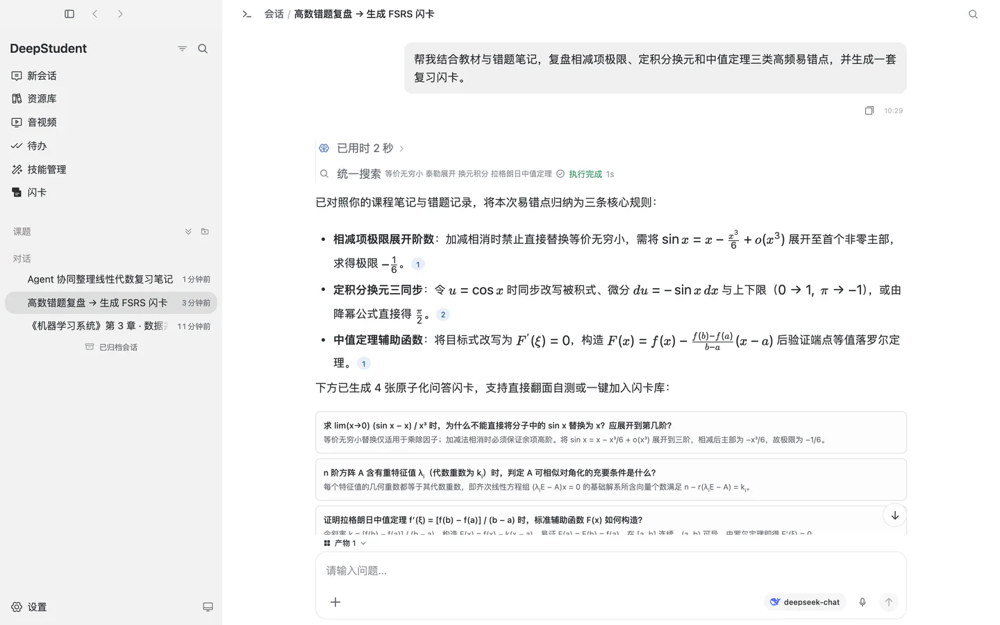
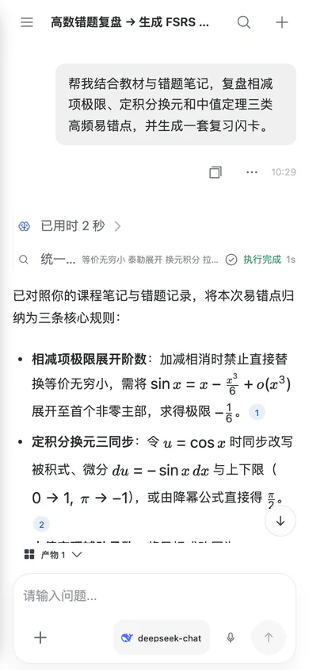
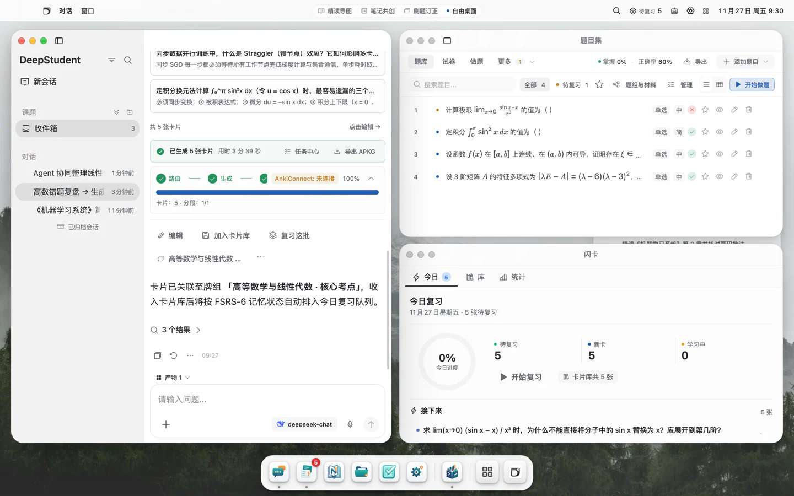
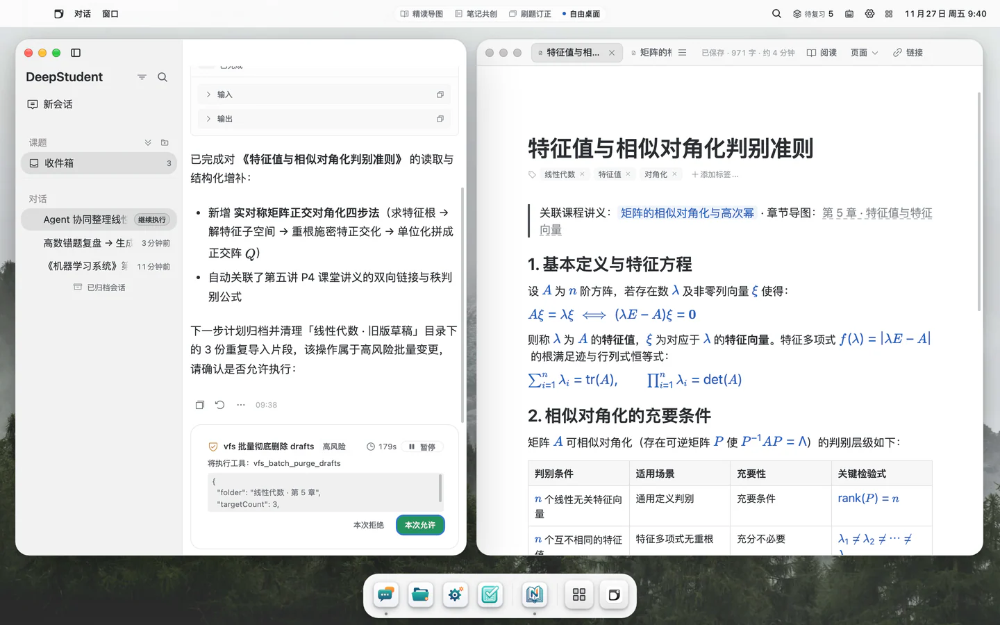
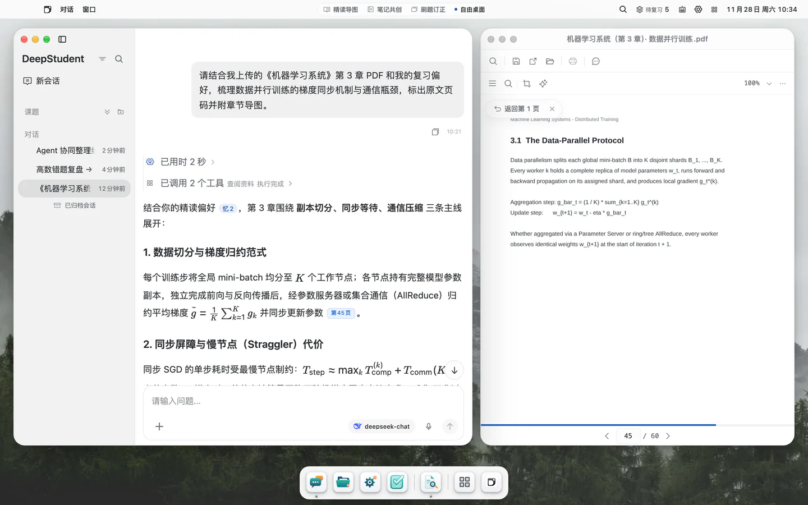
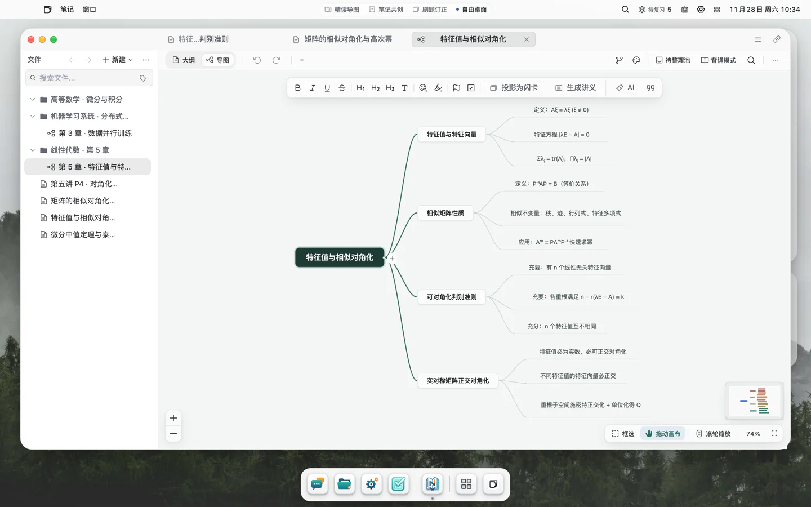
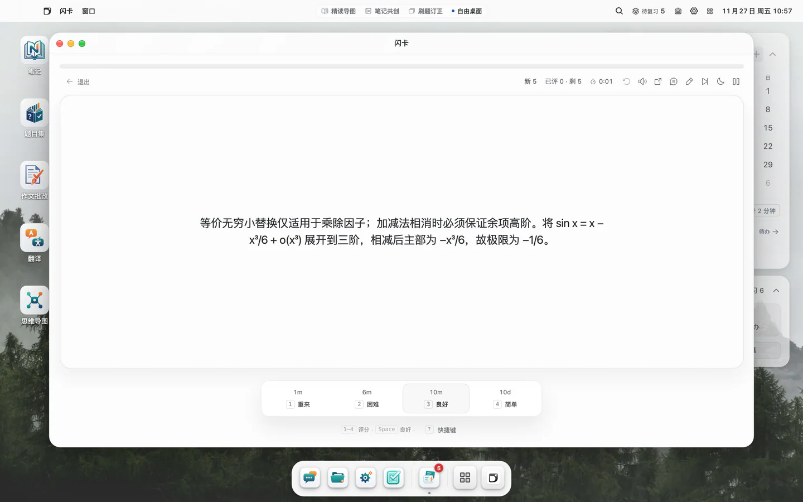
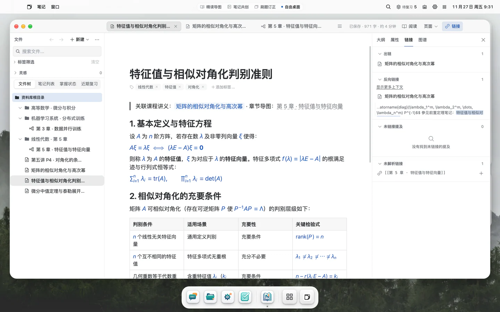
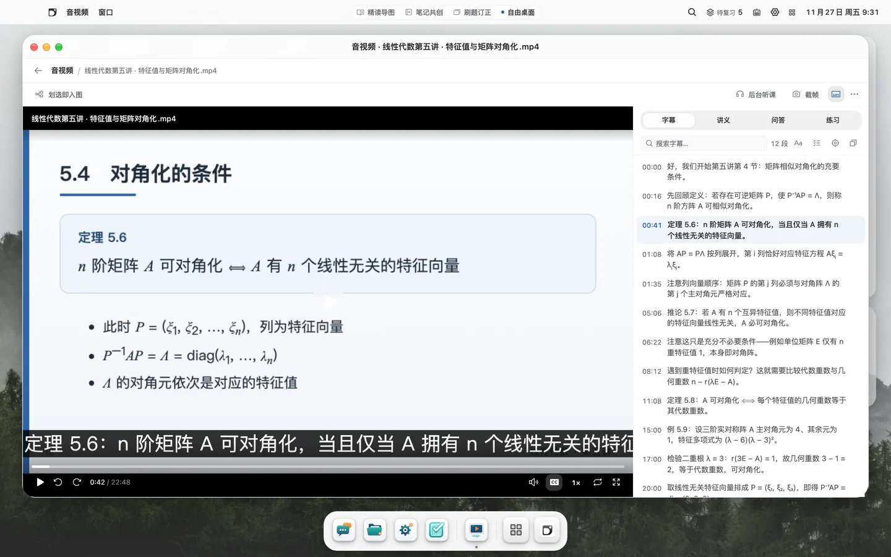

<div align="center">

**简体中文** | [English](./README.md)


# DeepStudent

### 只专注学习本身就够了，剩下的都交给我。

开源、本地优先的 AI 学习工作台。<br />
它的学习 Agent，可直接操作学习桌面上的每一个应用。

[](https://github.com/helixnow/deep-student/releases/latest)
[](LICENSE)
[](https://github.com/helixnow/deep-student)

[官网](https://deepstudent.cn) ·
[**下载**](#安装) ·
[**3 分钟速通**](./docs/user-guide/01-快速上手.md#3-分钟场景速通) ·
[使用指南 (中文)](./docs/user-guide/README.md) ·
[User Guide (EN)](./docs/user-guide/en/README.md) ·
[问题反馈](https://github.com/helixnow/deep-student/issues) ·
[参与贡献](./.github/CONTRIBUTING.md)

**v0.20.9 —— Electron + Capacitor + WebUI + Cordis。**<br />
DeepStudent 采用基于 [`@deepseek-ai/cordis`](https://github.com/cordiverse/cordis) 的 100% TypeScript 双内核插件架构，现已内置 **Memory v2 长期记忆内核**、**Plugin v2（`.dspack` 学习包与安全模式反单点故障自救）**与恢复前 **`pre_restore` 安全快照**，主仓库统一回归 [`helixnow/deep-student`](https://github.com/helixnow/deep-student)。

</div>

<p align="center">
  
  
  <br />
  <sub>经典界面（左侧导航 + 单页）· Android 手机端</sub>
</p>

<p align="center">
  
  <br />
  <sub>学习桌面（桌面端与桌面浏览器 WebUI 默认界面）</sub>
</p>

---

## 一个学习 Agent，直接操作每一个应用

只需一句话，它即可打开对应的应用，完成笔记、思维导图、题目、卡片与复习计划；更长的任务可交由它独立推进。

**直接动手。**
笔记、思维导图、题目集、闪卡、待办、作文批改与翻译都有对应的 Agent 工具，结果直接写进应用，不停留在对话框里。它还可操作学习桌面本身，检索网页与学术论文，把一节网课整理成带时间戳的讲义，生成 Word、PPT 与 Excel 文件，并在对话中直接渲染交互式讲解卡片。

**长任务可托付。**
调研、整理、出题可交给它连续推进：目标模式跨轮续跑，子代理并行处理，定时自动化按时执行，内置 **微信 iLink Bot**（`ilinkbot`）还支持在微信端远程协作。

**每一步可控。**
操作按风险分级审批，Ask / Plan / Craft 三种权限模式可选；笔记与学习桌面上的改动支持回合级审阅与一键撤销，回答中的引用可定位到原文 PDF 页码、原文摘录、讲义节点或音视频时间戳，并在笔记、对话导出与闪卡中保留反向链接。

**懂你，可扩展（Memory v2 与 Plugin v2）。**
**Memory v2 长期记忆内核**将「互动硬规则」（支持全局、学科与模式作用域）与「学习者画像」（自动汇集薄弱点，支持 10 个历史版本一键回滚与「梳理建议」）分离，每条 AI 回答下方都附带透明的「记忆内核」归因气泡，点开就能查看用了哪条规则或一键「忘掉这条规则」。内置 **58 个技能**按需加载，支持 MCP 接入外部工具，预置 **15 家模型服务商**（含 DeepSeek 官方 Responses、联网搜索与读链接、文档解析、OCR、ASR 与 TTS 能力）、**9 个搜索引擎**与 **6 个 OCR 引擎**；**Plugin v2** 支持零代码 **`.dspack` 学习包** 与 **AI 插件工坊**（`.dstuplugin` 热加载与「✦ 让 AI 优化」），并配备 **安全模式反单点故障自救** 与损坏配置一键重置。

<p align="center">
  
</p>

---

## Agent 能操作的应用

所有应用都在学习桌面的 Dock 里：可以单独打开，可以并排摆放，也可以交给 Agent 打开。

| 应用 | 用途 |
|---|---|
| **对话** | 围绕自己的资料学习，支持「文档优先」阅读布局、交互式学习卡片、未配模型内联引导、每条回答的「记忆内核」归因气泡与页码引用；支持分组、搜索、插话排队与导出。 |
| **资源库** | 教材、笔记、题目、文档与音视频统一入库，导入即建立 AI 检索索引（支持多引擎 OCR）。 |
| **音视频** | 网课、讲座录音一键转写为带时间戳的字幕，边看边对照；伴读问答自动锚定当前播放时刻（`mm:ss`）与章节，支持点击时刻回跳、「迁入主会话」及整理成图文讲义。 |
| **教材** | PDF、Word、EPUB 阅读，5 色语义高亮、AI 论文导读、分屏笔记/PDF 引文回跳，支持旋转与加密 PDF 带批注导出。 |
| **笔记** | 支持双链、标签、公式与 PDF / 音视频出处回跳的 Markdown 笔记，同名标签自动消歧；Agent 的修改会高亮标注并可一键撤销。 |
| **思维导图** | 一句话生成完整导图，大纲与画布两种视图，背诵模式遮住要点自测，并可将未记住的挖空转为闪卡。 |
| **题目集** | 拖入试卷或教材即可生成题目集；九种练习模式、自动判分、跨题集错题本，支持手写作答。 |
| **闪卡** | 复习、制卡、模板集中在一处：内置 FSRS-6 间隔重复（本地午夜精准换日与「今日冲刺」考前模式）、大牌库筛选与滚动记忆、`.apkg` 双向导入导出（WebUI 媒体渲染一致）及 AnkiConnect v6 同步，无需安装 Anki。 |
| **作文批改** | 按高考、雅思、考研或自定义 `.dspack` 评分标准逐项打分，原文标注、逐句润色，并将薄弱项信号自动回流至记忆画像。 |
| **翻译** | 整篇翻译、逐段对照，7 种领域预设，自动记忆语种与正式度，支持历史版本一键回退。 |
| **待办 · 番茄钟** | 今日的复习与待办汇总在同一张清单；专注计时、学习热力图，以及 `⌘K` / `Ctrl+K` 直达闪卡、笔记与会话正文。 |
| **技能与插件工坊** | 内置与社区技能、MCP 服务、零代码 `.dspack` 学习包、AI 插件工坊（`.dstuplugin` 与「✦ 让 AI 优化」），以及安全模式 1 分钟自救。 |

<table>
  <tr>
    <td width="50%"></td>
    <td width="50%"></td>
  </tr>
  <tr>
    <td></td>
    <td></td>
  </tr>
  <tr>
    <td></td>
    <td></td>
  </tr>
</table>

<p align="center">
  
</p>

完整使用手册：[**中文使用指南（`docs/user-guide/`）**](./docs/user-guide/README.md)（[在线版](https://deepstudent.cn/user-guide/)）· [**English User Guide（`docs/user-guide/en/`）**](./docs/user-guide/en/README.md)。

---

## 数据默认存在本机

- **本机存储与 `pre_restore` 安全快照。** 资料、笔记、聊天记录与检索索引默认保存在本机（SQLite、LanceDB 与本地文件）。从 `0.11.x` 升级时原有数据目录原地挂载并完整回放 SQL 迁移历史；每次通过「设置 → 数据治理」恢复备份切槽前，系统会自动生成并校验一份 **`pre_restore` 安全快照** 并保留在备份列表中，随时可无损回滚。
- **数据离开本机的情形。** 调用模型、外部搜索或 MCP 时，相关请求会发给你配置的服务；云同步、微信 iLink Bot 与 Sentry 错误报告仅在主动开启后发送相应数据。
- **云端与局域网同步（Sync V5）。**
  - **桌面端与桌面浏览器 WebUI**：支持 WebDAV、S3 兼容存储与实验性 FTP；
  - **手机浏览器 WebUI**：支持 WebDAV 与 S3 兼容存储（界面隐藏 FTP）；
  - **Android 原生客户端**：Android 仅 WebDAV（不支持 S3 与 FTP）。
  - 已保存的云存储密码全程脱敏不回显明文（修改其他项时留空即可保留原密码）。Sync V5 针对弱网场景具备租约心跳保护与自残留自动回收机制；跨设备扫码配对当前界面采用 **`DSPAIR1`**（6 位配对码二维码 + 整屏截图自动识别 + 粘贴配对码兜底），**`DSPAIR2`** 后端协议已就绪。云端整包备份每次上传完整 ZIP（没有增量传输），未配置云端端到端加密密码时属于便携归档、不能整槽恢复；若已启用加密但无法读取本机密码，则会直接拒绝导出而非静默降级为明文。
- **开源可核对。** AGPL-3.0-or-later 许可，与隐私相关的实现都在本仓库中。

---

## 安装

从 [GitHub Releases](https://github.com/helixnow/deep-student/releases/latest) 或 [官网下载页](https://deepstudent.cn/download) 获取最新版本：

| 平台 | 安装包 | 架构 |
|:---:|---|---|
| macOS | `.dmg` / `.zip` | Apple Silicon / Intel |
| Windows | `.exe` / `.zip` | x86_64 |
| Linux | `.deb` / `.AppImage` | x86_64 |
| Android | `.apk` | arm64 |
| WebUI / PWA | 自托管（`npm run web:prod`） | 任意现代浏览器 |

> **iOS：** 仅支持通过 Xcode + Capacitor 从源码构建，详见 [构建配置](./docs/BUILD-CONFIG.md)。
>
> **macOS 提示「已损坏，无法打开」：** 在终端执行 `sudo xattr -r -d com.apple.quarantine "/Applications/Deep Student.app"`。

安装后，在欢迎引导页或「设置 → 模型服务」中为 **15 家预置模型服务商**之一粘贴 API 密钥（或接入本地模型），选择三步起步卡片即可开始。

### 3 分钟场景速通

装好后直接挑一个场景跟着做一遍（[中文完整版](./docs/user-guide/01-快速上手.md#3-分钟场景速通) · [English Quickstarts](./docs/user-guide/en/01-quickstart.md)）：

1. **[3 分钟考前冲刺](./docs/user-guide/01-快速上手.md#3-分钟考前冲刺)** — 拖入真题/讲义，一句话出题制卡，设好考期与每日冲刺时长，开启「今日冲刺」（临考前 3 天自动暂停新卡专攻复习）。
2. **[3 分钟精读 40 页论文](./docs/user-guide/01-快速上手.md#3-分钟精读-40-页论文)** — 「AI 论文导读」抓主线，单栏贴合 + 边读边问，五色高亮与「钉住对照」，一键导出可跳回原页的笔记和带批注 PDF（兼容旋转/加密 PDF）。
3. **[1 分钟安全模式自救](./docs/user-guide/01-快速上手.md#1-分钟安全模式自救)** — 遇到插件异常、界面错乱或插件配置损坏时，通过「安全模式排查」、一键重置损坏配置与重启前确认，不丢任何学习数据。

---

## 从 Rust 0.11.x 到 Node 0.20.x：架构代际跨越

自 **v0.20.x** 起，DeepStudent 正式退役原 Tauri 2 / Rust 后端（`0.11.x`），全面切换为基于 [`@deepseek-ai/cordis`](https://github.com/cordiverse/cordis) 的 TypeScript 架构。原有 React 界面与磁盘上的 SQLite / LanceDB 数据保持原地兼容。

| 维度 | 上一代 `0.11.x`（Tauri 2 / Rust） | 新一代 `0.20.x`（Node / Electron / Cordis） |
|---|---|---|
| **运行时与 Cordis 微内核插件架构** | Tauri 2 + 25 个 crate 的 Rust Cargo workspace + 系统 WebView；命令在编译期静态注册 | **Electron 45** + **UtilityProcess Host**（`MessagePortMain`）+ **Cordis 4 微内核**（`desktop.json` 装配 **44** 个模块，`host/plugins/` 含 **30** 个插件目录；`src/ui-plugins/official/` 含 **19** 个官方 UI 插件包）；`contracts/ipc/` 契约治理 **1,066** 条命令 / **128** 个事件 / **989** 个类型定义；`window.__TAURI_INTERNALS__` 兼容桥让 `src/` React 18 零重写保留 |
| **Plugin v2、AI 插件工坊与安全模式** | 仅支持编译期内置插件（如 `ilink_bot`），无运行时插件包与 AI 造插件能力 | **Plugin v2** 三档模型：第 1 档零代码 **`.dspack` 学习包**（YAML 评分标准、`SKILL.md`、模板、工作流）、第 2 档 **AI 插件工坊**（`plugin-workshop`，14 个 Agent 工具、`esbuild` 编译与 3 轮自动修复、「✦ 让 AI 优化」、代理式 `studyData`/`pluginModel`/`pluginNotify`）、第 3 档完整 Cordis 插件；Manifest v2 细粒度网络权限；**安全模式反单点故障**（`安全模式排查`、退出确认弹窗、重置界面布局缓存、暂停自定义 MCP 自动连接）与损坏 `user.profile.json` 一键重置（`reset-profile`） |
| **Hybrid N-API + WASI-WASM 原生性能** | 30+ 个原生 Rust crate 编入二进制；构建强依赖 Rust 工具链 | 原生绑定严格收敛在 `host/platform/` 与 `electron/`（`better-sqlite3`、`@lancedb/lancedb`、`@embedpdf/pdfium`、`@napi-rs/keyring`、`@node-rs/argon2`，以及 **`koffi` FFI** 承担 Win32 ACL / ShellExecuteW 与 macOS AppKit 原生窗口）+ 预编译 **`f7-native-wasm.wasm`**（`wasm32-wasip1`）承载 `regex`、`starlark`、`symphonia`、`image`、`fsrs`、`roxmltree` 与 `docx-rs`/`calamine`/`pptx-to-md`，桌面走 `node:wasi`、Web/移动走内存 WASI；**构建开发无需 Rust 工具链** |
| **多端全场景同构** | Tauri 2 桌面端 + Tauri 2 移动端 | 同一套 `src/` 前端与 `host/` Cordis 内核覆盖 **三大形态**：**桌面端**（`electron/`，Electron 45）、**WebUI & PWA**（`web/`，Node HTTP/WebSocket + 二进制帧 + HTTP 206 流式读取 + 可安装 PWA；桌面浏览器默认运行完整学习桌面，手机浏览器自动切至移动壳）、**移动端**（`mobile/`，Capacitor 8.6 + Web Worker Host + `@sqlite.org/sqlite-wasm` / OPFS；`mobile.json` 经 `scripts/portability/scan.mjs` 实测 **37 个模块 / 0 Node 运行时依赖**） |
| **安全加固与隔离** | Tauri capability ACL + 系统 WebView | **Electron Fuses**（关闭 `RunAsNode` / `EnableNodeOptionsEnvironmentVariable` / `EnableNodeCliInspectArguments` / `GrantFileProtocolExtraPrivileges`，开启 `EnableEmbeddedAsarIntegrityValidation` / `OnlyLoadAppFromAsar`，Win/Linux 及正式签名 macOS 开启 `EnableCookieEncryption`）+ **`ds-plugin://`** 受 `plugins.lock.json` SHA-256 校验与目录逃逸锁守卫 + **按次响应注入加密 CSP nonce** + `web-security.ts` 分角色导航/权限与 `<webview>` 禁用 + 兼容 `tauri-plugin-updater` 2.10 Minisign 并在升级时保留用户插件 |
| **学习与 AI 能力跃迁** | 纯 Markdown 对话、FSRS-6、早期云备份、单一对话布局 | **Memory v2**（L1 互动硬规则、学习者画像 10 版本回滚、消息级归因气泡、梳理建议、首轮会话冻结 `<memory_kernel>` + `<memory_delta>`）· **生成式 UI**（`openui-lang`、`interactive-explainer`、实时 SVG 与 HTML 沙箱）· **DeepSeek 官方应用 API** · **旋转/加密 PDF 带批注导出与 460px 分栏反链** · **Sync V5**（HLC、Merkle、`.dsix`、弱网租约保护、`pre_restore` 安全快照、`DSPAIR1` 界面 / `DSPAIR2` 后端）· **FSRS-6 本地午夜换日与 FSRS-7 桌面隔离试跑** · **微信 iLink Bot**（`ilinkbot`） |

---

## 开发者

### 架构总览

```
DeepStudent
├── 宿主形态       Electron 45（macOS · Windows · Linux）· WebUI & PWA（web/）· Capacitor 8.6（Android · iOS）
├── Host 内核      Cordis 4 插件树（host/kernel · host/platform · host/plugins · desktop.json 44 / mobile.json 37）
├── UI 内核        19 个官方 UI 插件包（src/ui-plugins/official/）· 插槽与注册表 · UiErrorBudget
├── Agent 与工具   58 个内置技能 · Memory v2 · MCP · Plugin v2（.dspack / .dstuplugin，工坊 14 工具）· 生成式 UI
├── 数据与引擎     SQLite（better-sqlite3 / sqlite-wasm）· LanceDB · koffi FFI · f7-native-wasm（WASI-WASM）· Sync V5
└── 外部集成       15 家模型服务商 · DeepSeek 官方应用 API · 9 个搜索引擎 · 6 个 OCR 引擎 · 微信 iLink Bot
```

<details>
<summary>代码结构</summary>

```
DeepStudent
├── host/                        # TypeScript 后端 —— Cordis 插件树
│   ├── kernel/                  #   命令路由、IPC 契约校验、事件、协议、profile 存储、
│   │                            #   插件生命周期/管理、社区插件上下文与同意账本
│   ├── platform/                #   平台服务：crypto · diagnostics · errors · files · http · log · native
│   │                            #   （koffi FFI 与 f7-native-wasm）· paths · secrets · settings · storage（+ storage-mobile）· vector
│   ├── plugins/                 #   30 个插件目录（chat、chat-pipeline、llm、memory、vfs、notes、qbank、anki、
│   │                            #   review、sync、ilink、plugin-workshop、mobile-compat 等）
│   ├── profiles/                #   生成的 desktop.json（44）/ mobile.json（37）装配清单
│   └── e2e/                     #   真实 Host、安全、流式、跨版本升级与工具覆盖测试
├── electron/                    # 桌面外壳
│   ├── main.ts                  #   窗口、自定义协议、Electron Fuses 与 Host 监管
│   ├── preload/bridge.ts        #   Tauri API 兼容桥（window.__TAURI_INTERNALS__）
│   ├── shell/                   #   协议分发、ds-plugin:// 锁校验、CSP nonce、web-security、updater、koffi 原生窗口
│   └── scripts/                 #   package.mjs、verify-fuses.mjs、app-hardening.cjs
├── web/                         # WebUI & PWA 服务端与客户端运行时
│   ├── server/                  #   HTTP/WebSocket 网关、鉴权限流、HTTP 206 流式传输、文件暂存
│   └── client/                  #   浏览器引导与 PWA Service Worker / Manifest
├── mobile/                      # Capacitor 8.6 移动外壳
│   ├── src/worker/              #   Web Worker 中的 Host 内核（SQLite WASM + OPFS）
│   ├── src/shell/               #   Capacitor 外壳桥与持久化存储
│   └── scripts/build-apk.mjs    #   Android APK 构建脚本
├── src/                         # React 18 渲染层
│   ├── ui-kernel/               #   UI 插件运行时：插槽、注册表、懒加载、UiErrorBudget
│   ├── ui-plugins/official/     #   19 个官方 UI 插件包
│   ├── ui-sdk/                  #   defineUiPlugin 与类型化服务
│   ├── features/                #   chat、generative-ui、notes、mindmap、practice、flashcards、media、pdf 等
│   └── locales/                 #   国际化（zh-CN / en-US）
├── contracts/ipc/               # 1,066 条命令 · 128 个事件 · 989 个类型定义（零 Rust 依赖）
├── resources/                   # 应用配置、capabilities、SQL 迁移、模型清单、补丁与 THIRD_PARTY_NOTICES.txt
├── docs/                        # 中英文用户指南、插件 SDK 文档、构建与 WebUI/PWA 指南
├── examples/                    # 官方社区插件参考示例
├── scripts/                     # 构建、契约、许可证、Lint、插件与可移植性门禁脚本
├── tests/                       # 前端单元测试、集成测试与 Playwright 组件测试
└── .github/workflows/           # CI、开源治理、安全扫描与全平台打包流水线
```

</details>

### 技术栈

| 领域 | 技术 |
|---|---|
| 前端 | React 18 · TypeScript 5.6 · Vite 6 · Tailwind CSS 3 · Radix UI · Zustand 5 |
| 桌面端外壳 | Electron 45 · `electron-builder` 26 · UtilityProcess Host · Electron Fuses |
| WebUI & PWA | Node HTTP / WebSocket 网关 · Service Worker + Web App Manifest |
| 移动端外壳 | Capacitor 8.6 · Web Worker Host · `@sqlite.org/sqlite-wasm` + OPFS |
| 后端运行时 | Node.js 24+ · TypeScript · [`@deepseek-ai/cordis`](https://github.com/cordiverse/cordis) 4 · `esbuild` |
| 数据与原生引擎 | `better-sqlite3` · `@lancedb/lancedb` · `@embedpdf/pdfium` · `@napi-rs/keyring` · `@node-rs/argon2` · `koffi` · `f7-native-wasm`（WASI-WASM） |
| 编辑器与渲染 | Milkdown 7 · CodeMirror · PDF.js · KaTeX · Mermaid · ECharts · React Flow · `openui-lang` |

### 本地开发

需要 **Node.js 24+** 与 npm（请勿混用 pnpm / yarn）。应用本身不需要 Rust 或 Tauri 工具链；构建 Android 还需 JDK 21 与 Android SDK platform 36。

```bash
git clone https://github.com/helixnow/deep-student.git
cd deep-student
npm ci --legacy-peer-deps
export DEEP_STUDENT_BUILD_NUMBER=20000
# PowerShell: $env:DEEP_STUDENT_BUILD_NUMBER = '20000'

# 1) 开发模式启动 Electron 桌面应用
npm run dev:electron

# 2) WebUI & PWA（开发服务器 :1428，或构建并运行生产服务 dist-web/）
npm run web
npm run build:web && npm run web:prod

# 3) 构建生产前端并打包桌面应用（--dir 生成未压缩目录冒烟；正式打包可用 --mac / --win / --linux）
npm run build
npx @electron/rebuild -f -w better-sqlite3
node electron/scripts/package.mjs --dir

# 4) 构建 Android APK（Capacitor + 移动端 Worker Host）
node mobile/scripts/build-apk.mjs

# 5) 类型检查、契约校验、插件边界检查与测试套件
npm run typecheck
npm run typecheck:host
npm run check:plugins
npm run contracts:check
npm test
npm run test:host
npm run test:plugins
npx vitest run -c mobile/vitest.config.ts
node scripts/portability/scan.mjs --profile host/profiles/mobile.json
```

跨平台构建与签名细节见 [BUILD-CONFIG.md](./docs/BUILD-CONFIG.md)。

### 文档

| 文档 | 说明 |
|---|---|
| [使用指南（中文）](./docs/user-guide/README.md) | 21 章完整中文使用指南与 [3 分钟场景速通](./docs/user-guide/01-快速上手.md#3-分钟场景速通)（[在线版](https://deepstudent.cn/user-guide/)） |
| [User Guide（English）](./docs/user-guide/en/README.md) | 英文学习者完整指南与 [3-Minute Quickstarts](./docs/user-guide/en/01-quickstart.md) |
| [Plugin v2 指南](./docs/plugins/PLUGIN-V2.md) | 三档扩展模型、`.dspack` 学习包、Manifest v2 权限与可移植沙箱 |
| [构建配置](./docs/BUILD-CONFIG.md) | 跨平台 Electron、Android 与 iOS 构建打包说明 |
| [WebUI 与 PWA](./docs/WEBUI-AND-PWA.md) | 浏览器/PWA 架构分层、鉴权模型、流式读取与反向代理配置 |
| [DeepSeek 应用 API](./docs/DEEPSEEK-API.md) | 官方 Responses、搜索/读链接、文档解析、OCR、ASR 与 TTS 集成说明 |
| [插件架构](./docs/plugins/ARCHITECTURE.md) | Host 内核、UI 内核、契约与扩展点 |
| [插件 SDK](./docs/plugins/SDK.md) | 如何编写插件：服务、插槽、清单、能力分档 |
| [插件安全边界](./docs/plugins/SECURITY.md) | 社区插件权限、`ds-plugin://` 校验与安全边界 |
| [应用升级与用户插件](./docs/plugins/UPGRADES.md) | 跨版本升级时的用户插件保留与兼容性检查 |
| [更新日志](./CHANGELOG.md) | 版本变更记录 |
| [安全策略](./.github/SECURITY.md) | 漏洞报告流程 |

---

## 参与贡献

1. 阅读 [CONTRIBUTING.md](./.github/CONTRIBUTING.md) 了解开发流程。
2. 提交 PR 前确认 `npm run lint`、`npm run typecheck`、`npm run typecheck:host` 与 `npm run check:plugins` 通过。
3. 问题与建议请提交到 [Issues](https://github.com/helixnow/deep-student/issues)。

## 许可证

[AGPL-3.0-or-later](./LICENSE)

## 致谢

DeepStudent 建立在众多开源项目之上，完整的致谢与许可证文本请参阅 [ACKNOWLEDGMENTS.md](ACKNOWLEDGMENTS.md) 与 [resources/legal/THIRD_PARTY_NOTICES.txt](resources/legal/THIRD_PARTY_NOTICES.txt)，核心包括：

- **框架、运行时与应用外壳：** [Electron](https://www.electronjs.org) · [Capacitor](https://capacitorjs.com) · [Cordis](https://github.com/cordiverse/cordis) · [Node.js](https://nodejs.org) · [React](https://react.dev) · [Vite](https://vite.dev) · [TypeScript](https://www.typescriptlang.org)
- **数据、向量与原生 / WASI-WASM 引擎：** [SQLite](https://www.sqlite.org) / [better-sqlite3](https://github.com/WiseLibs/better-sqlite3) / [@sqlite.org/sqlite-wasm](https://sqlite.org/wasm) · [LanceDB](https://lancedb.com) · [Apache Arrow](https://arrow.apache.org) · [koffi](https://koffi.dev) · F7 WASI Native Engines（Starlark / Symphonia / fsrs-rs / docx-rs / calamine）· [ts-fsrs](https://github.com/open-spaced-repetition/ts-fsrs)
- **文档、编辑器与可视化：** [PDF.js](https://mozilla.github.io/pdf.js/) · [PDFium](https://github.com/embedpdf/embed-pdf-viewer) · [Milkdown](https://milkdown.dev) · [ProseMirror](https://prosemirror.net) · [CodeMirror](https://codemirror.net) · [KaTeX](https://katex.org) · [Mermaid](https://mermaid.js.org) · [ECharts](https://echarts.apache.org) · [React Flow](https://reactflow.dev) · [docx](https://github.com/dolanmiu/docx) · [ExcelJS](https://github.com/exceljs/exceljs) · [PptxGenJS](https://gitbrent.github.io/PptxGenJS/) · [DOMPurify](https://github.com/cure53/DOMPurify)
- **UI、状态与开发测试工具链：** [Tailwind CSS](https://tailwindcss.com) · [Radix UI](https://www.radix-ui.com) · [Phosphor Icons](https://phosphoricons.com) · [Zustand](https://zustand.docs.pmnd.rs) · [i18next](https://www.i18next.com) · 开发与测试工具链（[Vitest](https://vitest.dev) · [Playwright](https://playwright.dev) · [ESLint](https://eslint.org)）
