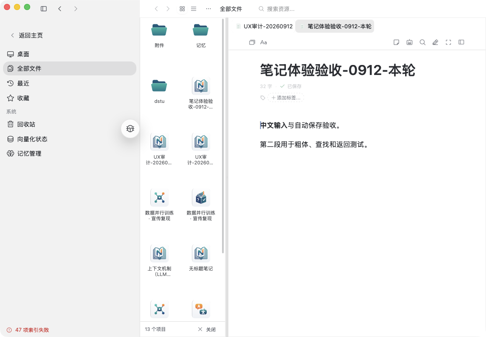
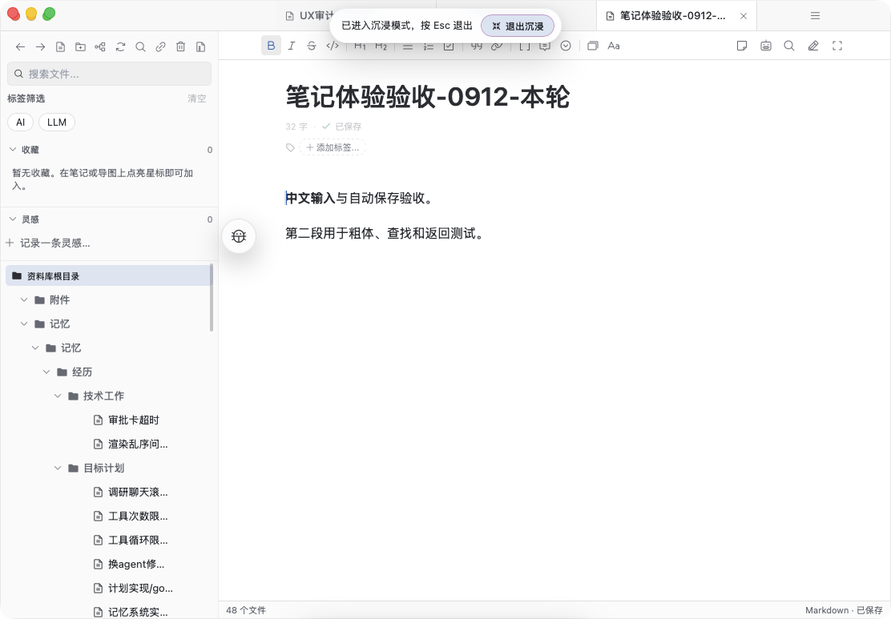

# 笔记模块 UI/UX 审计

日期：2026-09-12。审计对象是当前 Crepe/Milkdown 笔记实现，重点覆盖学习桌面、资源管理器和正常移动布局。

## 结论

当前“不好用”的首要原因不是单个编辑器能力不足，而是同一任务被多个层级同时管理：全局顶栏、资源页命令、编辑器工具栏、块菜单、Crepe selection toolbar 和移动端适配层各自拥有入口、显隐状态和布局规则。用户需要先判断“这条命令属于哪个层”，而不是直接完成写作。窄屏上的重叠和按钮消失正是这种职责分散的视觉结果。

Crepe 暂时不应被整体替换。已验证基础编辑、粗体、查找、保存、刷新后恢复和返回资源库都可用；先统一命令模型和页面结构，收益会高于迁移编辑器。之后再用真实笔记语料做底座 PoC。

## 实测证据

测试通过 `npm run tauri dev` 启动的真实 Tauri 应用完成，使用笔记“笔记体验验收-0912-本轮”，内容为两段中文文本，并实际执行粗体、查找、阅读/编辑切换、属性、刷新和重新打开。

### 正常移动布局

窗口宽度 390×844 和 320×667，Workbench 关闭。320 宽时标题自然换行，编辑区没有横向溢出；工具栏保持加号、撤销、重做和格式入口。展开后命令采用固定四列网格，按钮最小触控尺寸为 44px，命令不再依赖横向裁切。插入菜单会收起主命令区，避免两个大面板叠加。

已修复并复测：

1. 原移动工具栏是隐藏滚动条的横向列表，窄宽用户无法发现或稳定触达末端命令。现在有明确展开按钮和网格。
2. 原笔记页在全局顶栏下又保留一行独立的 more/properties chrome。移动端页面命令已并入全局资源菜单，编辑器空 chrome 不再占位。
3. 原多个移动 header 共享菜单状态，隐藏的 inactive view 仍把 portal 菜单挂到 body，刷新菜单会重复出现。现在只为 active view 渲染 header，刷新后菜单数为 0，屏幕上只保留一个入口。

额外发现并修复：查找面板原来绝对定位在零高度容器中，会压住标题；现在改为正常流布局。原生手机键盘、IME、系统返回手势和真实触摸惯性因没有测试设备，尚未验证。

### 资源管理器视图

在约 1112px 桌面窗口中，左侧全局导航约 320px，资源 Finder 约 194px，笔记内容约 590px，实际正文宽约 474px。Finder 网格卡片约 88px，文件名频繁截断；导航树、资源管理器和阅读区同时常驻，阅读任务被两层管理 UI 挤压。桌面编辑命令被压缩为 Aa 溢出入口，而页面级命令又保留在右侧，入口语义不一致。

### 学习桌面

学习桌面会叠加桌面全局顶栏、应用图标、窗口 chrome、标签栏、资源树和笔记工具栏。实测打开笔记后编辑区约 702px；进入“沉浸模式”后主要变化是窗口铺满，左侧资源树、三标签栏和编辑工具仍然存在。因此当前沉浸模式是窗口级尺寸状态，不是针对阅读或写作任务的专注状态。

## 根因分层

- **信息架构**：文件浏览、笔记编辑、属性、AI、窗口管理没有清晰的页面/块/应用边界。
- **命令系统**：同一能力被 header、toolbar、slash、selection menu 和 page menu 重复暴露；部分命令通过 silent catch、可选 no-op 或插入字面量 `/` 实现，界面没有诚实反映能力是否可用。
- **响应式策略**：通过裁切横向条解决“更多命令”，而不是定义窄屏优先级；容器高度、portal 和 inactive view 的生命周期又由不同组件控制。
- **视觉层级**：移动端标题、标签栏、统计、标签、编辑器和浮动调试按钮都争夺首屏。属性页的“AI 笔记摘要”、章节数、概览和主要章节重复展示元数据，短笔记也会被卡片填满。
- **编辑器边界**：Crepe 默认 selection toolbar、项目桌面 toolbar、移动 toolbar 和页面命令并存。大型 `NotesCrepeEditor` 与 `CrepeEditor` 自定义层说明集成面很宽，但不能单凭代码行数断定性能或能力问题。

## 对照研究

本次竞品结论来自官方文档、公开源码和公开 issue，未把竞品原生 App 安装到本机进行盲测。

Obsidian 的移动设计把导航栏、标签数量、快速切换和页面菜单留在稳定的少量入口；编辑时才出现编辑 toolbar，更多命令通过横向滑动或自定义配置获得。它的关键是“写作时减少常驻 chrome”，而不是把桌面功能缩小塞进手机。

Notion 按对象分配命令：文本选择负责行内格式，块句柄负责移动/转换/删除，页面菜单负责页面级设置，移动键盘 toolbar 负责插入和编辑，`+` 打开完整菜单。移动端列布局收成单列，部分复杂能力明确只在桌面提供。当前实现应借鉴这种对象边界和诚实降级。

Joplin 的 Markdown、离线优先和笔记树适合作为可靠保存/打开的参考，但其公开 issue 也显示移动富文本 toolbar、Android 性能和主题细节仍需长期维护。Outline 的文档中心 UI 值得参考，但其 BSL 1.1 是 source-available，不应当作为无条件开源底座结论。

## 编辑器底座选择

| 底座 | 适合方向 | 主要代价 |
|---|---|---|
| 继续 Crepe/Milkdown | Markdown、现有自定义节点、最快交付 | 需要清理 toolbar 和命令边界；迁移不会自动修复 UX |
| CodeMirror 6 | Markdown/text-first、长文和移动输入 | Live Preview、块操作、引用和富节点都要自己实现 |
| Tiptap | 需要完全掌控 React UI 和 PM schema | 仍是 ProseMirror，迁移主要解决控制权，不解决产品设计 |
| BlockNote | 想转向 Notion 式 block-first | MPL 2.0 核心；移动键盘、Enter、Backspace 等公开 PR/issue 说明仍需 PoC 验证，Markdown 自定义节点转换可能丢信息 |
| Plate | Slate 生态、React 定制 | 更换编辑模型，现有 Markdown/节点迁移成本高 |
| BlockSuite | Yjs/块和画布深度融合 | MPL 2.0、平台迁移重；仓库 README 已提示重大变更和维护状态风险 |

建议：短期保留 Crepe，先把命令能力抽成一份 capability 表，由页面/块/选择/移动 toolbar 复用；中期做 Crepe 与 BlockNote 的小型 PoC，使用现有笔记中的标题、列表、任务、表格、公式、双链、AI 引用和图片做无损往返测试。只有当产品明确选择 block-first 且现有 Markdown 兼容层无法承受时才迁移。若产品仍以 Markdown 文件和学习引用为核心，CodeMirror 6 是更干净的 text-first 方向，但功能建设量最大。

## 优先级路线

1. **P0：完成交互收口**。定义页面级、块级、文本级、应用级四类命令；每个能力只保留一个主入口；移动端只保留返回、标题/标签、正文、编辑 toolbar 和页面菜单。
2. **P0：修复布局契约**。所有浮层只挂 active view；用 flow/grid/flex 约束编辑器 chrome；禁止用隐藏横向滚动条承载不可见的主命令；浮动调试件不能覆盖产品控件。
3. **P1：收缩移动信息密度**。标签栏变成数量入口，元数据默认折叠，属性页合并重复统计；阅读模式隐藏编辑器 toolbar，编辑模式才显示。
4. **P1：统一能力状态**。移除 silent no-op；不可用命令禁用并说明原因，slash/toolbar/menu 使用同一执行函数和同一 eligibility 判断。
5. **P2：底座 PoC**。在真实语料和 Android/iOS 真机上验证 IME、选区、撤销、粘贴、滚动、保存、长文和自定义节点，再决定是否迁移。

## 验证边界

本报告的已验证范围是本机真实 Tauri 桌面应用的 Workbench、资源管理器和窄屏移动布局。未验证真实手机的系统键盘/IME、触摸惯性、系统返回行为，也未声称完成 Obsidian/Notion 原生 App 的实机性能对比。
