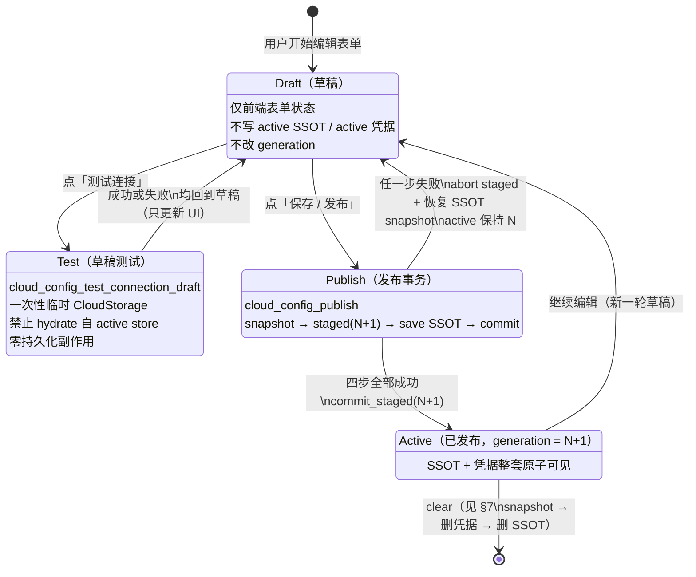
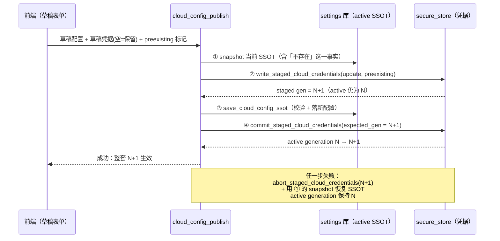

# 0824 Wave2-D R2：云配置三态状态机（Draft / Test / Publish）冻结设计

> 本文是 0824 Wave2-D 第 2 轮「配置事务 + auto-sync」的**冻结设计文档**。
> 实施员已按本设计开工，本文不得另起炉灶、不得回改语义；只允许追加澄清。
> 本文只写文档：不改产品代码、不动 MERGE-PLAN、不动 `coordinator.rs`、不 commit。
> 关联台账：`docs/dev/wave2-D-ledger.md` §7（第 2 轮预告即本设计的摘要版）。

---

## 1. 背景：今日病灶（为什么需要状态机）

### 1.1 P1：测试连接 = 先发布后测试，失败不回滚

现状前端 `src/features/settings/components/CloudStorageSection.tsx` 的
`doTestConnection` 顺序是：

1. `cloudApi.saveCredentials(...)` → 后端 `secure_store` 把凭据**写入 active
   凭据记录**（`cloud_storage_credentials`）；
2. `cloudApi.saveCloudConfigSsot(config)` → 后端把非敏感配置**写入 active
   SSOT**（settings 库键 `cloud_storage.config.safe_v1`）；
3. `cloudApi.checkConnection(config)` → 才开始真正测连接。

也就是说：**用户点「测试连接」的那一刻，草稿就已经变成正式配置**。第 3 步
失败只改 UI 状态（`setConnectionStatus`），第 1、2 步写下去的坏凭据/坏配置
留在 SSOT 里，auto-sync、备份、恢复等一切后台消费者随即开始使用它。

后端 `cloud_storage_check_connection`（`src-tauri/src/cloud_storage/mod.rs:200`）
还有一层隐性耦合：它入口处 `hydrate_cloud_config(&app, &mut config)`，即用
**active 凭据**填充 IPC 传来的空密码占位。这意味着这条命令**天然测的是
「active 凭据 + 传入配置」的杂交体**，不可能拿来测纯草稿——所以草稿测试
必须是一条新命令，禁止复用它（见 §4）。

### 1.2 P2：auto-sync 调度器只在设置页挂载

`src/stores/syncStatusStore.ts:510` 的 `ensureAutoSyncSchedulerStarted()`
目前全仓只被 `SyncSettingsSection.tsx` / `SyncTab.tsx` 两个设置组件调用。
用户开了自动同步、重启应用、不进设置页 → 调度器根本不存在。修法见 §8。

### 1.3 clear 的 partial 病灶

现状 `cloud_config_ssot_clear`（`src-tauri/src/cloud_config_commands.rs:596-612`）
顺序是 **先删 SSOT（settings 键）→ 再删凭据**。第二步失败时留下
「无配置但有孤儿凭据」的半清除态，且第一步已不可恢复。修法见 §7。

---

## 2. 状态机总览

三个状态描述的是**一份云配置（配置 + 凭据）的生命周期位置**，不是 UI 页面
状态。核心不变量：

> **不变量 I1（唯一发布点）**：`cloud_storage.config.safe_v1`（active SSOT）
> 与 `cloud_storage_credentials`（active 凭据）只允许被 `cloud_config_publish`
> 和 clear 流程写入/删除。Draft 与 Test 对二者零写入。
>
> **不变量 I2（generation 单调）**：active 凭据带 generation `N`（u64，缺省
> 0）。只有 publish 成功 commit 才会 `N → N+1`；测试、失败的 publish、abort
> 都不改变 `N`。
>
> **不变量 I3（原子可见性）**：任何时刻，外部消费者看到的（SSOT, 凭据）
> 组合要么是发布前的整套 `N`，要么是发布后的整套 `N+1`，不存在
> 「新 SSOT + 旧凭据」或「旧 SSOT + 新凭据」的杂交视图。

### 2.1 状态图（mermaid）

### 2.2 发布事务时序（mermaid）

---

## 3. Draft（草稿态）

- **定义**：用户在设置页表单里的一切编辑（provider、endpoint、用户名、
  密码输入框、加密口令输入框、root、allowInsecure 勾选……）都只存在于
  前端组件状态（以及既有的 localStorage 表单缓存），属于草稿。
- **红线**：草稿阶段**绝不**触碰 active SSOT（`cloud_storage.config.safe_v1`）
  与 active 凭据（`cloud_storage_credentials`）。今日 `doTestConnection` /
  `doSaveConfig` 里「先 `saveCredentials` 再 `saveCloudConfigSsot`」的两次
  写入在新状态机下从测试路径**整体移除**——测试不再有任何持久化前置。
- 草稿里的密码框语义：**留空 = 「发布时保留 active 里的现值」**。这个语义
  只在 Publish 合并时生效（§5），Draft/Test 阶段空密码就是空密码（§4）。

## 4. Test（草稿测试态）

- **命令**：新增 `cloud_config_test_connection_draft`。
- **输入**：一次性草稿配置（Safe 形状，非敏感）+ 草稿凭据（本次表单里
  实际输入的密码原文）。
- **行为**：在内存中构造临时 `CloudStorageConfig`，`create_storage` 后执行
  `check_connection`，返回成败与诊断。整个过程：
  - **禁止 hydrate 自 active store**。既有 `cloud_storage_check_connection`
    入口第一行就 `hydrate_cloud_config`（用 active 凭据填空密码），因此
    **不能复用那条命令当草稿测试**——否则「空密码草稿」会被 active 密码
    偷偷补全，测的是杂交体而不是草稿。新命令对传入凭据**原样使用**：
    空就是空，空密码连不上就如实报连不上。
  - **禁止 bump generation**。测试与 generation 完全无关。
  - **禁止写 SSOT / 凭据 / 任何 staged 记录**。测试是纯只读旁路，测完
    临时对象即弃。
- **「空=保留」不作用于本态**：合并语义是 publish 专属（§5）。草稿测试
  必须诚实地测用户此刻输入的东西。
- 加密口令与测试：`check_connection` 不消费加密口令，草稿口令不参与连接
  测试，也不因测试而写入任何地方。
- 平台能力校验（Android 无 FTP、slim 构建无 S3）沿用
  `SafeCloudStorageConfig::validate_and_normalize` 一套规则，在测试入口
  同样 fail-closed，稳定错误码不变
  （`E_FTP_UNSUPPORTED_ON_ANDROID` / `E_S3_UNSUPPORTED_IN_BUILD`）。

## 5. Publish（发布态）

- **命令**：新增 `cloud_config_publish`。语义：把草稿（配置 + 凭据增量）
  作为**单个逻辑事务**变成 active。
- **固定顺序**（不得重排）：
  1. **snapshot SSOT**：读取并保留当前
     `cloud_storage.config.safe_v1` 的原始值（包括「该键不存在」这一事实，
     恢复时对应删除该键）。
  2. **write_staged_cloud_credentials(update, preexisting)**：把凭据增量写入
     staged 区，返回 staged generation `N+1`。staged 写入内部先以 active
     凭据为基底做「空=保留」合并（见下），合并结果整体进 staged。此刻
     active 凭据与 active generation `N` 未被触碰。
  3. **save SSOT**：`save_cloud_config_ssot` 校验并落新配置。
  4. **commit_staged_cloud_credentials(expected_gen = N+1)**：staged 凭据
     原子切换为 active，generation `N → N+1`。
- **失败处理（任一步）**：`abort_staged_cloud_credentials(expected_gen)`
  丢弃 staged 记录 + 用步骤 1 的 snapshot 恢复 SSOT（有值则写回原值，
  原本不存在则删除键）。恢复完成后 active generation 保持 `N`，外部视图
  与发布前逐字节一致。回滚自身失败属于故障矩阵条目（§6 F6/F7），必须
  fail-closed 报错并留下可诊断状态，绝不假装成功。
- **「空=保留」只在这里**：publish 的凭据合并沿用今日
  `apply_nonempty_update` 语义（`secure_store.rs:1996`）——update 里空白/
  缺省字段表示「保留 active 现值」。这是防止空白表单误删凭据的既有契约，
  原样保留；但它的作用域收缩为 publish 合并这一处。
- **口令准入策略不变**：
  - 存量口令放行：`encryption_password_is_preexisting = true`（换机/重装
    重输原口令、legacy 迁移入口）时放行任意非空长度，红线是**存量不收紧**
    （Step 22 pick #7）。
  - 新设口令仍是 8 字符门（`MIN_CLOUD_ENCRYPTION_PASSWORD_CHARS = 8`，
    稳定码 `E_CLOUD_ENCRYPTION_PASSWORD_TOO_SHORT`），在步骤 2 的 staged
    写入入口执行——不合格则整个 publish 在写任何东西之前失败。

### 5.1 secure_store 分代 API（agent 3 实现，本文只冻结契约）

在既有单键 `cloud_storage_credentials` 之上叠加 staged 记录 + active
指针/generation：

| API | 契约 |
| --- | --- |
| `cloud_credentials_active_generation() -> u64` | 读 active generation；无凭据/无分代元数据时**缺省 0**（存量安装首次 publish 视为从 0 出发）。 |
| `write_staged_cloud_credentials(update, preexisting) -> staged_gen` | 以 active 为基底做「空=保留」合并 + 口令准入校验，结果写入 staged 区，返回 `active_gen + 1`。不触碰 active。重复调用覆盖旧 staged。 |
| `commit_staged_cloud_credentials(expected_gen)` | CAS 语义：仅当 staged 存在且其 gen == `expected_gen` == active_gen + 1 时，staged 原子转正、generation 前进；否则报错不动。 |
| `abort_staged_cloud_credentials(expected_gen)` | 丢弃匹配 `expected_gen` 的 staged 记录；staged 不存在时幂等成功。绝不触碰 active。 |
| `delete_cloud_credentials_transactional()` | 供 clear 使用：带前置 snapshot 能力的凭据删除（配合 §7 的回滚），替代今日裸 `delete_cloud_credentials` 在 clear 路径上的直接调用。 |

崩溃语义：进程在 commit 前死亡 → 重启后只有孤儿 staged 记录，active 整套
`N` 完好；孤儿 staged 在下一次 publish 的 write_staged 覆盖或 abort 清理，
永远不会被自动转正。

---

## 6. 失败矩阵

「结果视图」指外部消费者（auto-sync、备份、恢复、同步命令的
`load_hydrated_cloud_config_ssot`）能看到的（SSOT, 凭据, generation）。

| # | 阶段 | 失败点 | 处置 | 结果视图 | 用户所见 |
| --- | --- | --- | --- | --- | --- |
| F0 | Test | `create_storage` / `check_connection` 失败（网络、凭据错、平台不支持） | 无需处置：本来就零写入 | 整套 `N`，逐字节不变 | 测试失败提示；草稿原样保留可继续改 |
| F1 | Publish ① | snapshot 读 SSOT 失败（settings 库 IO） | 立即失败，尚未写任何东西 | 整套 `N` 不变 | 发布失败（`E_CLOUD_CONFIG_STORAGE`），可重试 |
| F2 | Publish ② | staged 写入失败（口令太短 / secure_store IO） | 立即失败；staged 若半写则 abort 清理 | 整套 `N` 不变 | 口令门报 `E_CLOUD_ENCRYPTION_PASSWORD_TOO_SHORT`；IO 报存储错误 |
| F3 | Publish ③ | save SSOT 失败（校验拒绝 / 体积超限 / 库 IO） | `abort_staged(N+1)`；SSOT 未写成则无需恢复，半写则按 snapshot 恢复 | 整套 `N` 不变 | 配置校验错误原样透出（`E_CLOUD_CONFIG_INVALID` 等） |
| F4 | Publish ④ | commit 失败（expected_gen 不匹配 / secure_store IO） | `abort_staged(N+1)` + snapshot 恢复 SSOT | 整套 `N` 不变 | 发布失败，提示重试 |
| F5 | Publish 中 | 进程崩溃（任意步骤间） | 重启后：active 整套 `N` 完好；孤儿 staged 待覆盖/abort；若崩在 ③ 后 ④ 前，SSOT 是新值而凭据是 `N`——下次 publish/启动清理路径必须按 snapshot 语义收敛（实现时 staged 元数据须携带 SSOT snapshot 以便重启恢复，或启动时检测孤儿 staged 即回滚 SSOT） | 收敛回整套 `N` | 重启后配置回到发布前 |
| F6 | Publish 回滚 | abort staged 自身失败 | fail-closed：报错并保留孤儿 staged（无害，不会转正）；继续尝试 SSOT 恢复 | active 仍 `N`；staged 残留待清理 | 发布失败 + 建议重试 |
| F7 | Publish 回滚 | snapshot 恢复 SSOT 失败 | fail-closed：报错，明示「配置可能处于新值但凭据仍为旧代」；下次 publish/clear 前置检查收敛 | SSOT 新值 + 凭据 `N` 的已知坏态（有诊断） | 明确错误，指引重试发布或 clear |
| F8 | Clear ① | snapshot 失败 | 立即失败，不删任何东西 | 整套 `N` 不变 | 清除失败，可重试 |
| F9 | Clear ② | 删凭据失败 | 立即失败（凭据删除是原子单键删除，失败即未删） | 整套 `N` 不变 | 清除失败，可重试 |
| F10 | Clear ③ | 删 SSOT 失败 | 用 snapshot 回滚：恢复凭据记录 | 整套 `N` 恢复 | 清除失败，配置完好可重试 |

矩阵总原则：**除 F7 这一显式声明的已知坏态外，任何失败路径的终态都是
「整套 `N` 不变」**；F7 也必须带稳定诊断且可被下一次操作收敛，绝不静默。

---

## 7. clear：收敛「先删 SSOT 再删凭据」

今日 `cloud_config_ssot_clear` 先 `delete_setting(SSOT)` 再删凭据，第二步
失败留下孤儿凭据且 SSOT 已丢、无法回滚。新顺序：

1. **snapshot**：读取当前凭据记录（密文层面即可）与 SSOT 原值。
2. **删凭据**：`delete_cloud_credentials_transactional()`。失败 → 整体
   失败，什么都没删（F9）。
3. **删 SSOT**。失败 → 用 snapshot **恢复凭据**，回到整套 `N`（F10）。

方向选择理由：凭据先删，则中间态是「有 SSOT 无凭据」——这正是
`load_hydrated_cloud_config_ssot` 已有的 fail-closed 分支
（`E_CLOUD_CREDENTIALS_UNAVAILABLE`），消费者安全拒绝；而今日顺序的中间态
「无 SSOT 有孤儿凭据」既泄留密文又无人报告。clear 成功后 generation 语义：
凭据记录连同分代元数据一并删除，下一次 publish 从缺省 0 重新起代。

---

## 8. auto-sync 启动点

- **主启动点（新增）**：App 层完成持久化 store hydration 后，幂等调用
  `ensureAutoSyncSchedulerStarted()`。「hydration 后」是硬前置：调度器读
  `useAutoSyncStore` 的持久化开关与间隔，rehydrate 之前调用会拿到默认值。
- **设置页调用（保留）**：`SyncSettingsSection` / `SyncTab` 里的现有调用
  可以保留——`start()` 本就幂等——但**不再是唯一启动点**。
- 行为红线不变：调度器每轮仍走既有 fail-close 分类（租约被占 / 后端忙 /
  未配置加密口令 → 静默跳过不计失败），仍与手动同步共享前端全局锁。

---

## 9. 与 BACKUP_GLOBAL_LIMITER 的关系

`BACKUP_GLOBAL_LIMITER`（`src-tauri/src/backup_common.rs:74`，容量 1 的全局
信号量）串行化本进程所有数据治理任务（同步/备份/恢复/ZIP）。publish/clear
**不持有**这把锁——它们是配置写入，不是数据治理任务；因此**配置发布可能
与一次正在跑的同步/备份并发**。约定：

- **会话开局钉死 generation**：持锁的长任务（同步/备份）在拿到 permit 后、
  构建 `CloudStorage` 之前，同步读一次
  `cloud_credentials_active_generation()`，并把当时 hydrate 出的整套配置+
  凭据作为**开局快照**贯穿本轮会话。
- **中途 generation 变则本轮不得混入新凭据**：会话内任何需要重新 hydrate
  的点（重试、续传、二阶段）必须二选一：
  1. **用开局快照**（推荐）：全程只用开局那份配置+凭据对象，天然不会混代；
  2. **fail-closed**：若实现上必须重新读 store，则重读后先比对
     generation——与开局不一致就立即终止本轮并报「配置已变更，请重新
     同步」，绝不把 `N+1` 凭据混进按 `N` 配置开始的会话（半程换目标端点/
     换加密口令会直接制造杂交上传）。
- 反向无需担心：publish 的四步不读写任何同步会话状态；同步会话如果全程
  用开局快照，publish 何时发生都不影响其正确性——只影响**下一轮**。

---

## 10. 禁区与验收

**禁区**（本轮实施与本文档共同遵守）：

- 不改 MERGE-PLAN；不改 `coordinator.rs`（两加法
  `apply_vfs_init_missing_tables` / `pre_repair_vfs_v20260824_note_props`
  必须原样保留）；
- 存量短口令 preexisting 放行不收紧；新设 8 字符门不放松；
- 「空=保留」合并语义只收缩作用域（仅 publish），不改变合并规则本身。

**验收对照**（实施完成后按此核对）：

- Draft/Test 路径对 `cloud_storage.config.safe_v1` 与
  `cloud_storage_credentials` 零写入（红灯测试：「测试失败 SSOT 未变」）；
- `cloud_config_test_connection_draft` 不 hydrate、不 bump generation；
- `cloud_config_publish` 四步顺序与失败矩阵 F1–F7 一致，失败终态整套 `N`；
- clear 按 §7 顺序，F8–F10 成立；
- 重启不进设置页，auto-sync timer 存在（红灯测试：「重启不进设置 timer
  存在」）；
- 持锁长任务对 generation 变更 fail-closed 或全程开局快照。
